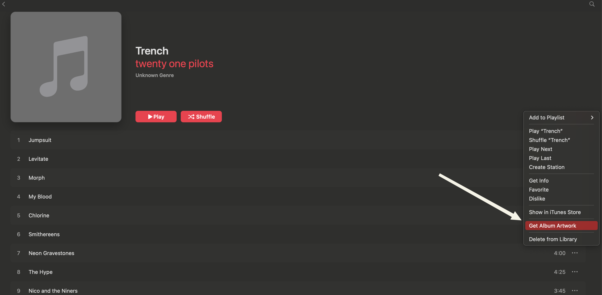

​	Recently (today), I decided to switch from YouTube Music to Apple Music. However, being a broke student, I don't obviously want to pay for it. My family also has YT Music Premium, which furthers the case.

​	I thus brainstormed a (purportedly "brilliant") plan to get my songs onto Apple Music. The key note is that basically all of my listens nowadays are for Twenty One Pilots songs (don't ask), so I could just use one of the many YouTube video downloaders out there to download their five major albums (after getting signed).

​	I ended up using a *lot* of AI help along the way!
## Downloading the videos
​	After doing a bit more research, I found [yt-dlp](https://github.com/yt-dlp/yt-dlp) to be a good option as a terminal downloader CLI. This was 11pm, so I was not willing to dig through docs. So instead, I just opened the Zed assistant and set it to use GPT-5 via Copilot. I then pasted in the whole README of yt-dlp and prompted:
> Write a command to, given a YouTube/YT Music playlist link, download all of its videos in audio format. Maybe also strip the thumbnail if possible

And it worked perfectly!
```markdown
Use one of these, replacing <playlist_url> with your YouTube or YouTube Music playlist link.

Widely compatible (mp3), best quality:
yt-dlp -f "ba/b" -x --audio-format mp3 --audio-quality 0 --no-embed-thumbnail -o "%(playlist_title)s/%(playlist_index)03d - %(title)s.%(ext)s" "<playlist_url>"

Keep original audio (no re-encode; usually opus/m4a):
yt-dlp -f "ba/b" -x --audio-format best --no-embed-thumbnail -o "%(playlist_title)s/%(playlist_index)03d - %(title)s.%(ext)s" "<playlist_url>"

Optional: also strip all embedded metadata (including any cover art) from the output audio:
... --ppa "ExtractAudio+ffmpeg:-map_metadata -1"

Notes:
- -f "ba/b" prefers audio-only formats (faster, smaller); falls back to best if needed.
- --no-embed-thumbnail is the default; included here for clarity.
- Output path includes a playlist folder and a zero-padded index. Adjust as you like.
```
​	I then proceeded to boot up 5 Ghostty terminals to run the commands in parallel, since my assumption was that most of the time used by the CLI would just be fetching the videos, with less time actually decoding and extracting them. For this, I copied-and-pasted the YouTube Music URLs by hand since it was fast enough. Each command looked something like this:
```zsh
yt-dlp -f "ba/b" -x --audio-format mp3 --audio-quality 0 --no-embed-thumbnail -o "Blurryface/%(title)s.%(ext)s" "https://music.youtube.com/playlist?list=OLAK5uy_nBZwH-qHNY6l8n4EHnjkhYO8p3lcukTYI" && say done
```
This way, I could just drag the folders into Apple Music and use the "Get Album Artwork" feature to automatically find and update the album art of each album.

The first major issue that arose was that songs weren't ordered properly -- they were arranged alphabetically! With this setup, the Clancy tracklist would be:
1. At the Risk of Feeling Dumb
2. Backslide
3. Lavish
4. Midwest Indigo
5. Navigating
6. Next Semester
7. Oldies Station
8. Overcompensate
9. Paladin Strait
10. Routines in the Night
11. Snap Back
12. The Craving (Jenna's Version)
13. Vignette
## Ordering the tracklists
​	One way to correctly order the albums, would be, for each song:
1. Right click on the song and select "Get info"
2. Clicking on the tab for track number
3. Figuring out the number of the track in the ordered album
4. Inputting that number
​	That much brainpower is absolutely impossible at 11pm! So instead, I fired up a Gemini CLI instance.
> Why did I use Gemini CLI here?
>
> TL;DR I don't really know. It might just be because I was already in Ghostty so using a CLI was the fastest option. I chose not to use gpt-5 since, while it is really smart, I don't want to wait that long for an operation that isn't that hard!

My initial prompt was:
> Can you figure out how to edit the metadata of the song files here to set their track numbers in the right order? thanks!

Gemini promptly discovered that I have ffmpeg installed and proceed to use that to spawn multiple concurrent terminal requests to edit the metadata. Worked well! I changed the prompt a bit to add some clarifications and ensure that it would continue to use that method:
> Can you figure out how to edit the metadata of the song files here to set their track numbers in the right order? thanks! Use ffmpeg. Set the album and artist name as well -- artist should be "twenty one pilots" with no caps. They should be in the right order for the album​

and promptly proceeded to spawn 4 more Gemini CLI agents to run. I slightly underestimated the performance hit of running 4 heavy Node processes and 50 instances of ffmpeg on my aging laptop (it was literally unusable while the commands were executing) but it ended up working.

Just one more big bug.
## Updating song durations
​	One more issue: all of the song durations didn't match their actual audio data! For example, Mulberry Street was over 8 minutes, which is obviously outrageous.

​	After playing some of the songs I found that Apple Music correctly jumps to the next song right after the exact audio ended, so it was purely an issue in the metadata. Nothing that a little gpt-5 can't handle!

​	I hopped back to my Zed instance, fired up GPT-5 in the assistant and prompted:
> There are a lot of mp3 files in this directory whose metadata's length doesn't match the actual audio length. Can you write a Python or Bash script to fix their metadata and run it?

It wrote and ran the following script -- once again, worked flawlessly.
```bash
#!/usr/bin/env bash
# fix_mp3_duration.sh
# Remux MP3s in-place to correct duration metadata (e.g., missing/incorrect VBR headers)
# Uses ffmpeg stream copy (no re-encode) and forces writing a Xing header.

set -Eeuo pipefail
IFS=$'\n\t'

# -------------------------------
# Config / Defaults
# -------------------------------
DRY_RUN=0
QUIET=0
BACKUP_EXT=""
EXIT_CODE=0

# -------------------------------
# Helpers
# -------------------------------
log() {
  if [[ "$QUIET" -eq 0 ]]; then
    printf "%s\n" "$*" >&2
  fi
}

err() {
  printf "ERROR: %s\n" "$*" >&2
}

usage() {
  cat >&2 <<EOF
Usage: $(basename "$0") [options] [FILES_OR_DIRS...]

Repairs MP3 duration metadata by remuxing with ffmpeg (codec copy) and replacing files in-place.

Options:
  -b EXT    Keep a backup copy of each file with extension EXT (e.g. ".bak")
  -n        Dry run; show what would be done without modifying files
  -q        Quiet mode; minimal output
  -h        Show this help

Examples:
  $(basename "$0")                          # Process MP3s under the script's directory
  $(basename "$0") /path/to/music           # Recursively process this directory
  $(basename "$0") -b .bak *.mp3            # Process given files, keep backups with .bak
  $(basename "$0") -n "Album/Track 01.mp3"  # Dry-run on a single file
EOF
}

command_exists() {
  command -v "$1" >/dev/null 2>&1
}

# Gather mp3 files from CLI args (dirs recurse). If no args -> script's directory.
gather_files() {
  if [[ "$#" -eq 0 ]]; then
    local script_dir
    script_dir="$(cd -- "$(dirname -- "${BASH_SOURCE[0]}")" && pwd -P)"
    find "$script_dir" -type f \( -iname '*.mp3' \) -print0
    return
  fi

  for p in "$@"; do
    if [[ -d "$p" ]]; then
      find "$p" -type f \( -iname '*.mp3' \) -print0
    elif [[ -f "$p" ]]; then
      case "${p,,}" in
        *.mp3) printf "%s\0" "$p" ;;
        *) err "Skipping non-mp3 file: $p" ;;
      esac
    else
      err "Path not found: $p"
      EXIT_CODE=2
    fi
  done
}

# Safely create a temp output path in the same directory with .mp3 extension
make_tmp_out() {
  local src="$1"
  local d b tmp
  d="$(dirname -- "$src")"
  b="$(basename -- "$src")"
  # Hidden temp file in same dir, ending with .mp3 so ffmpeg picks the mp3 muxer reliably
  tmp="${d}/.${b}.fix.$$.$RANDOM.mp3"
  printf "%s" "$tmp"
}

process_one() {
  local src="$1"
  # Check readable
  if [[ ! -r "$src" ]]; then
    err "Not readable: $src"
    EXIT_CODE=2
    return
  fi

  local tmp out rc
  tmp="$(make_tmp_out "$src")"
  out="$src"

  if [[ "$DRY_RUN" -eq 1 ]]; then
    local backup_note=""
    [[ -n "$BACKUP_EXT" ]] && backup_note=" (backup: ${src}${BACKUP_EXT})"
    log "[DRY] Remux: $src -> $out$backup_note"
    return
  fi

  # Ensure tmp is cleaned on failure
  cleanup() {
    [[ -f "$tmp" ]] && rm -f -- "$tmp" || true
  }
  trap cleanup RETURN

  # Remux with:
  # - stream copy (-c copy) to avoid re-encoding
  # - write a Xing header (-write_xing 1) so duration can be accurately derived
  # - preserve metadata (-map_metadata 0), map everything (-map 0) including album art
  # - id3v2.3 for maximum compatibility
  # - explicit mp3 container (tmp ends with .mp3)
  if [[ "$QUIET" -eq 1 ]]; then
    ffmpeg -hide_banner -loglevel error -nostdin -y \
      -i "$src" \
      -map 0 -map_metadata 0 -c copy -id3v2_version 3 -write_xing 1 \
      "$tmp" || rc=$? || true
  else
    log "Remuxing: $src"
    ffmpeg -hide_banner -loglevel warning -nostdin -y \
      -i "$src" \
      -map 0 -map_metadata 0 -c copy -id3v2_version 3 -write_xing 1 \
      "$tmp" || rc=$? || true
  fi

  rc="${rc:-0}"
  if [[ "$rc" -ne 0 ]]; then
    err "ffmpeg failed on: $src (exit $rc)"
    EXIT_CODE=3
    return
  fi

  if [[ ! -s "$tmp" ]]; then
    err "ffmpeg produced empty file for: $src"
    EXIT_CODE=3
    return
  fi

  # Optionally back up original
  if [[ -n "$BACKUP_EXT" ]]; then
    cp -p -- "$src" "${src}${BACKUP_EXT}" || {
      err "Failed to create backup for: $src"
      EXIT_CODE=4
      return
    }
  fi

  # Atomic-ish replace
  mv -f -- "$tmp" "$out" || {
    err "Failed to replace: $src"
    EXIT_CODE=4
    return
  }

  # Success for this file
  trap - RETURN
  log "Fixed: $src"
}

# -------------------------------
# Parse args
# -------------------------------
while getopts ":b:nqh" opt; do
  case "$opt" in
    b) BACKUP_EXT="$OPTARG" ;;
    n) DRY_RUN=1 ;;
    q) QUIET=1 ;;
    h) usage; exit 0 ;;
    \?) err "Unknown option: -$OPTARG"; usage; exit 2 ;;
    :) err "Option -$OPTARG requires an argument"; usage; exit 2 ;;
  esac
done
shift $((OPTIND - 1))

# -------------------------------
# Preflight checks
# -------------------------------
if ! command_exists ffmpeg; then
  err "ffmpeg not found in PATH. Please install ffmpeg and try again."
  exit 127
fi

# NOTE: ffprobe is not required for this approach; we rely on ffmpeg remux only.

# -------------------------------
# Main
# -------------------------------
# Gather files (null-delimited) and process
# shellcheck disable=SC2046
while IFS= read -r -d '' mp3; do
  process_one "$mp3"
done < <(gather_files "$@")

exit "$EXIT_CODE"
```
And no, I have no clue what the code actually does. For all I know, it leaks my personal data to attackers. But I trust GPT-5 to exactly follow my instructions (sometimes to a fault! it will do something stupid without question because I told it to).

After a bit more cleanup, I finally could drag my folders into Apple Music and live happily ever after.
