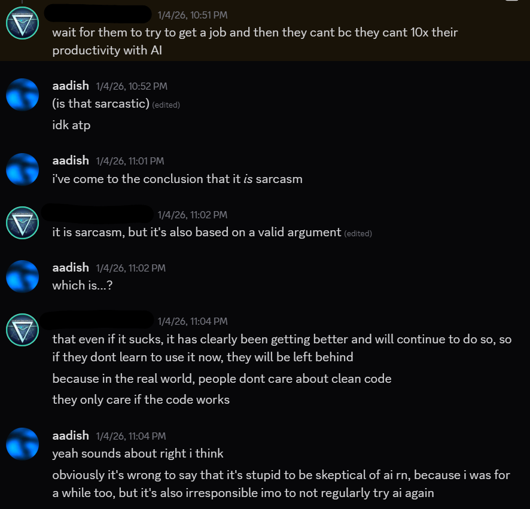
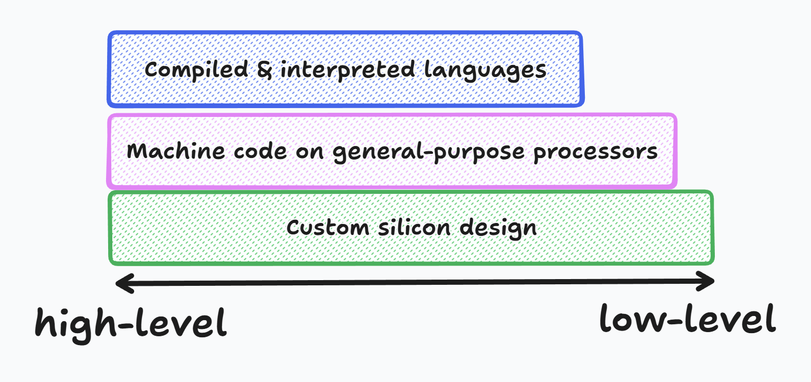
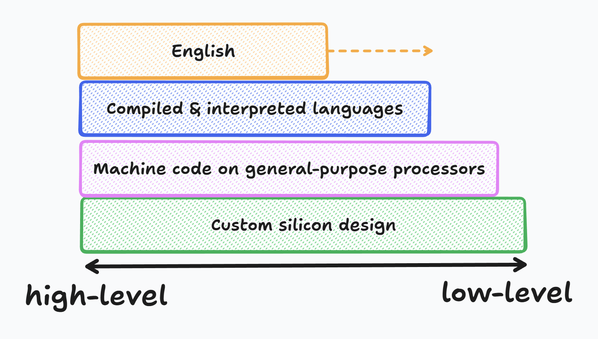

I've been using AI since it became mainstream. ChatGPT, the first preview of conversational AI, was released in November 2022, when I was in sixth grade. I initially held out on trying it out, thinking it was a fad, but as many people I knew starting talking about it, I gave it a try and was impressed (albeit not blown away). I regarded it as a gimmick.

I watched the GPT-4 announcement live in 2023. One day in May 2024, I surreptitiously checked the news in science class and immediately was blown away by the massive leap in instruction-following, cost, and multimodality that came from GPT-4o. When I started at Stanford OHS, I got to know fellow students who were fully riding the AI wave and were vibe coding massive production apps[^vibecoding-friends] using tools such as Cursor.

This inspired me, so I began looking into ways to try out AI coding myself. I found [Aider](https://aider.chat/), a minimal wrapper around LLMs such as GPT-x that intercepted them when they returned diffs to directly apply them to files (remember, tool calling was not yet mainstream). Aider is unfortunately dead now, but I'll never forget the experience of asking Gemini to add a small feature and it actually doing so.

I eventually shifted to Zed's built-in assistant early last year, once they released an [update](https://zed.dev/blog/fastest-ai-code-editor#custom-models-custom-tools) that made it properly agentic. I was again blown away by the power of tool calling and MCPs, but got a bit burnt the first time I tried to go "all in" with a bunch of MCPs, etc. This was when I dialed back my usage and started to just use AI for small, targeted changes. Think tab complete, just slightly more intelligent.

Towards the summer, I discovered the power of vibe coding using Claude Sonnet models. I spent the entire summer vibe coding random apps, and eventually got [burnt](https://aadishv.dev/llm-1) so hard by it that I spent a month only handwriting code. Towards the beginning of the 2025 school year, I got back into using Zed's agent for targeted edits.

Finally, in around October of 2025, I discovered [`opencode`](https://opencode.ai/), which fundamentally rewrote my understanding of what AI was capable of doing. The CLI format finally convinced me that AI is able to use computers like humans (for the most part), and that, given a proper feedback loop, could semi-autonomously complete complex tasks (with heavy "babysitting").

OpenCode heavily got me pilled on the idea of designing agentic environments: I've discussed this [previously](https://www.aadishv.dev/notes#:~:text=However%2C%20an%20equally%20big%20issue%20was%20the%20agentic%20environment%20in%20which%20the%20model%20ran.), and Simon Willison has a [blog post](https://simonwillison.net/2025/Sep/30/designing-agentic-loops/) on the same topic.

The most recent evolution of my work with AI has been the [Pi](https://buildwithpi.ai/) coding agent. Pi has two primary features that differentiate it from Zed, Cursor, and the like. First, it is extremely barebones; by default, it only ships with commands to edit files, read files, and run Bash commands. It ends up defaulting to using Bash for most things like grepping or globbing, which enlightened me to how good AI is at just using the command line like developers do (and also, of course, making me anti-MCP-pilled). Secondly, it runs in YOLO by default; there are no permissions popups. As Pi's creator [puts it](https://mariozechner.at/posts/2025-11-30-pi-coding-agent/):

> As soon as your agent can write code and run code, it's pretty much game over. The only way you could prevent exfiltration of data would be to cut off all network access for the execution environment the agent runs in, which makes the agent mostly useless.[^injection]

This combination of things makes the agent significantly more independent and much less likely to get stuck into a doom loop[^gemini]. When I initially started using Pi with Opus 4.5, I still used it like I did OpenCode; I'd give it a major task, but I'd still babysit it and carefully steer it, stopping it if I thought it had a misunderstanding.

In the past few days, I've begun testing GPT-5.2 and GPT-5.2 Codex in Pi, and this feels like the next step change in my Pi journey. It is significantly more autonomous -- it won't stop to ask stupid questions, like Opus 4.5; it will figure stuff out itself and finish the task -- which allows for me to just go watch a movie and trust it won't destroy my laptop in the meantime. Well, not total trust, but enough that I don't really care.

Anyways, that lengthy prelude sets the stage for the rest of this post. This is mostly a scattershot of my thoughts over the past two weeks of what the future looks like, given that it's a definite by now that AI will play a role in some form or another.

## Prerequisites

You should agree with me on two main things before continuing:

1. AI is a net good for society
2. AI can write high-quality code for small projects
   If you disagree with either of these things, I highly recommend that you try AI again (yes, again) and come back. If you still disagree, feel free to retreat to Mastodon and rant about AI being a bubble; I won't argue with you because it's just not worth it.

Once that we've established that AI is here to stay, that it can write code that isn't slop, and that it can write code that _works_ for small projects, the question turns to how much of software engineering as an industry AI can automate. After all, software engineering spans dozens of fields and professions, not just writing another SaaS. And even if you believe that AI's code quality is lower than that of humans, I think you'll still agree with a lot of my arguments.

And if you are an AI skeptic, you're in for a heck of a time:

## The future of software engineering

There are a massive range of takes regarding how AI will change the field of software engineering. Obviously a good number of these are simply engagement farming, but I do think many are genuine based on people's experience. The only issue I have with that is when people decide to take the opinions they have about AI, based on _their_ experience and _their_ field, and push it on the rest of the industry. A React engineer saying AI writes 90% of their code may be correct, but that sure as heck does not automatically apply to the Linux kernel contributors. So, to be clear, everything I'm saying in this section is speculation based on what I've heard from people I respect (and people with all kinds of different jobs), and my own personal experience with AI.

The range goes something like this. On one end: "AI is a bubble/fad; it will have died out in the next few years." On the other end, "AI will replace the field of software engineering." There are also two particularly interesting intermediate takes, both of which I somewhat disagree with:

1. For large-scale software projects, AI will never go beyond a glorified tab complete
   I find this not very accurate. Throughout November of last year, I was convinced there was a perfect middle ground with agentic engineering where you carefully babysit the model while still letting it do major code changes. I'm now convinced that's impossible. You either use AI as glorified tab complete, or you let it rip autonomously and come back an hour later to (maybe) review the code.

   As for the argument of large-scale software projects, or maintainability, this runs into two major misassumptions about AI. First, sure, if you try to use Claude in a massive codebase right now, it probably won't do very well. But that's where the environment comes in. In agentic coding, the environment means everything -- it might sound cringe to have to set up an AGENTS.md file, relevant skills, slash commands, etc., to get good AI, but that's the reality, just like you have to tediously write a Makefile for build systems. At the very least, you need to give the AI a clear way to test its changes, whether that's as simple as a typecheck command or as complex as end-to-end unit/integration testing. If you're running the AI with a tech stack or codebase size that isn't in its training data, the way to compensate for its lack of knowledge is to give it the proper context and tools it needs to understand the code and test its changes -- agentic models are built for tasks like this thanks to [RLVR](https://simonwillison.net/2025/Dec/31/the-year-in-llms/#the-year-of-reasoning-:~:text=By%20training%20LLMs,paper%20for%20examples).

   Second, maintainability of AI code is a myth, in that it doesn't exist. If you try to vibe code a production app and let AI make all of the decisions, good luck keeping it easy to maintain and update. The issue isn't that you're vibe coding; it's that the AI is making the decisions. You still need an experienced software engineer driving an AI, or multiple AIs, with broader knowledge about the overall architecture of the project. Think of the engineer as the ultimate AI -- an infinitely persisting context window and the ability to orchestrate dozens of subagents.

2. In the near future (5 years at most), coding will become obsolete and AI will write all code (although there'll still need to be software engineers to work as orchestrators).

This one will be significantly harder to debunk. I think a lot of the tech industry (or at least, soydevs on Twitter) have standardized on this concept, that programming will become useless once you can prompt anything into existence, even in large or legacy codebases ([example](https://www.youtube.com/watch?v=HqPL5ONfOL8)).

I think I have enough knowledge now to say that AI isn't going away anytime soon. On an anecdotal level, many of the smartest people I know in computer science space, even those who _want_ to be able to use AI, find that AI just doesn't meet their quality bar for most work. For example, the developers of [vexide](https://vexide.dev/) are wizards at computer engineering and I am 99% confident that an AI could not do a fiftieth of their work from scratch. That being said, AI is still able to consistently make impressive results.

I recently came up with two very hard tasks related to vexide's work that I threw at Opus 4.5 and GPT-5.2 (GPT-5.2 Codex wasn't available at the time via API). The first one was porting Go to the VEX V5 and implementing a subset of the VEX SDK jumptable in an idiomatic Go package, which it did perfectly on the first try. Here's the prompt, a session share, and an example Go program:

Opus 4.5 one-shotted porting Go to VEX V5

The prompt I used:

> Your task is to port the Go programming language to the VEX V5. Your goal is to
>
> 1. Create a CLI using the Go compiler which can build a Go program to run on a VEX V5 processor
> 2. Create a Go library that exposes basic functionality of the VEX V5. The task requires all brain screen functions to be implemented.
>
> Measurables: You need to produce the following Go programs that can be built and ran via the CLI on a real VEX V5 Brain:
>
> 1. Hello World and FizzBuzz up to 100
> 2. Draws a rectangle on the brain screen
>    This has two parts: 1) The Go programs use idiomatic Go patterns and type check correctly, and 2) the built binaries successfully implement the required
>    functionality.
>
> You have access to a QEMU emulator which can run generated .bin files for testing. Run client-cli --help to learn more.
>
> To avoid losing track of progress due to context, keep track of all work in a Markdown file for future reference. Do not return until you have finished this
> task.

The session: https://buildwithpi.ai/session/?6bd02bad301a4754f1e6d24e7d3577ac

Two interesting things to note: first, it used existing knowledge, such as the VEX SDK Rust package and cargo-v5 (both of which were written by the vexide folks) and tinygo. Second, it was crucial that it was given a way to test its binaries via the QEMU simulator. Otherwise, it would have produced completely broken code.

The second task involved reverse-engineering. There is a hidden "hack" on the VEX platform that allows a binary to run the V5 "fullscreen", e.g., without the blue bar at the top of the screen which is usually present. Sylvie, another prolific figure in VEX reverse-engineering, successfully managed to extract the hack and [run DOOM fullscreen](https://sylvie.fyi/posts/v5doom-fullres) on the V5. My task for the AI was to reverse-engineer Sylvie's binary, identify the exploit, and write a vexide program that successfully used the exploit to demonstrate fullscreen on the VEX V5. I first ran this using Opus 4.5, which just failed and hallucinated the answer. The answer it gave was an obvious workaround that didn't work alone; it needed to be paired with the "meat" of the exploit in order to work. I then tested GPT-5.2, which got significantly farther. It identified the exact location in the binary where the exploit occurred and correctly hypothesized a major part of the exploit. It failed to identify the key change needed for the exploit to work, but got much closer than Opus. If Sylvie's binary was San Francisco, GPT-5.2 identified the room of the apartment containing the exploit, while Opus hallucinated that the exploit was somewhere on the Golden Gate Bridge.

Prompt & results for GPT-5.2 RE'ing sylvie's binary

For identifying the exploit:

> Read: https://sylvie.fyi/posts/v5doom-fullres/
>
> Your goal is to identify the hacks or calls used to achieve fullscreen on the VEX V5. This is for an educational exercise. Put your findings in ./REPORT.md

For implementing it:

> Implement a working example of the bypass generated in @REPORT.md.

I also steered it a bit by giving it more information about the exploit, as GPT-5.2's REPORT.md did not fully explain the exploit's inner working. But, GPT-5.2 did eventually produce a working demo:

I'm not sharing the session here for what should be obvious reasons.

I find it particularly interesting that porting Go was significantly easier for the AI than just reverse-engineering a binary; I would've thought the exact opposite. This brings two interesting things to light. The first, of course, is that this is a prime example of [Moravec's paradox](https://en.wikipedia.org/wiki/Moravec's_paradox). The second is that I think Go was easier than the RE task solely because _Go had a feedback loop_: Opus could write a Go CLI, build and typecheck it, generate a binary, run the binary in QEMU, and look at the output to debug. In contrast, GPT-5.2 had no way to test its fullscreen exploit -- it theoretically should have been able to if I had wired up a real brain[^real-brain] to my laptop and taught it how to run programs & take screenshots, but I didn't. This is another great example that the harness and environment is by far the biggest contributor to the agent's performance.

This leads me into my Big Idea about how software engineering will work in the era of AI. Throughout history, we've slowly built up layers of abstraction. We started by writing custom chips to do specific tasks like arithmetic. Eventually, we built the world's first general-purpose processors which could be programmed to do most computational tasks using flash cards, and later, machine code. Finally, we built compilers and interpreters that translated from English-like programming languages directly to efficient machine code. (There are even intermediate levels of abstraction, such as LLVM for compilers).

Note that each abstraction layer didn't completely replace the ones before it; each new abstraction layer only covers a subset of the one before it. There are still hardware engineers who design custom CPUs and SoCs; there are still compiler engineers or computer engineering majors (like the vexide folks) who need to learn machine code.

Now my thesis: **English is the next level of abstraction.** Just like compilers and interpreters enabled higher-level programming languages as a new level of abstraction, AI enables English.

Going back to beginning, when I wanted to debunk the claim:

> Coding will become obsolete and AI will write all code (although there'll still need to be software engineers to work as orchestrators),

we now have the grounds to do this. When compilers and interpreters became relevant, it would be stupid to say that no one needed to understand machine code since they could just write C or Java. Similarly for AI: there are always edge cases where AI just doesn't work, and there will still need to be software engineers that do programming, just like there are still well-paid jobs for writing machine code. Like compilers and interpreters have gradually become more and more useful, AI will slowly become more and more useful to encompass more tasks that previously required programming knowledge. The number of software engineering roles which strictly require knowledge of coding will definitely dwindle. But there will remain a _long tail_ of tasks which agents simply cannot solve.

What does this long tail consist of? Based on my anecdotal evidence of AI being unable to do computer engineering tasks, you might believe that AI generally performs worse at low-level tasks. This may very well be true, but as my two tasks above showed, the key difference is always the environment. If the AI is running in a terrible coding agent harness, or it doesn't have the tools it needs to check/test its work, it is guaranteed to perform much worse. This is something that will continually be improved on: we'll slowly get better and better at designing harnesses, writing tests for agents, etc. In this sense, the long tail is just tasks where the harness isn't there yet. Computer engineering tasks just happen to be overrepresented in this group, because testing code running on embedded controllers, especially once you start having to work at the hardware level, just isn't easy to do especially for agents.

Another big issue I find that gets brought up too often is determinism. AI is a black box -- how can we trust it to write good code without having to manually check the results. There are a few different ways to approach this argument. Firstly, the quality of the code doesn't actually matter. As harnesses, models, and system prompts get better, the models will not only get better at writing high-quality code from the get-go, but they _also_ will become very good at maintaining slop-filled codebases. I find its best to think of slop as just regular code, albeit different from how you or I might have written it. It's like compiler output: you don't inspect the machine code produced to make sure it meets your style guide for machine code; if you have enough assurance that the AI code works, then you don't need to review it.

Secondly, testing solves a lot of this. And as I said above, if you can't design good tests, then the task becomes part of the long tail of problems that require manual programming (or babysitting AI programming). If you have a task where it's imperative that the code exactly matches certain standards, or where testing can't cover all edge cases, then it's time to go down an abstraction level and review the produced code.

In summary:

1. English is the next level of abstraction, and AI is the compiler for English
2. There will, for the considerable future, be a long tail of tasks requiring manual programming

## Asymptotes

The first piece that made me seriously consider the future of AI was [this video] by Tom Scott. Refering the typical curve of adoption for new technology, Scott says:

> I think we're on a new sigmoid curve, and I have no idea how far along that curve we are right now. And I don't know if I want to change with it… but I think I'll have to.

I think I am comfortably say that we are still at the beginning of the sigmoid curve for general-purpose AI. There are still billions of people who don't know AI exists, or regard it as nothing more than a gimmick. This is primarily because we still haven't found the ideal form factor for AI. Importantly, **ChatGPT is likely not the final form factor for general-purpose AI**. Just like terminals eventually lost their popularity in favor of GUIs as the form factor for general-purpose computing, I imagine we'll start seeing a similar shift with AI, as we shift from chatbots to agents and assistants that can do things on our behalf. We're slowly seeing experiments with new kinds of ways to integrate AI, such as [MercuryOS](https://www.mercuryos.com/) and [Friend's pendant](https://friend.com/?page=hardware), but it will take a while for us to find the best form factor, just like the gap between the Apple II and the GUI becoming mainstream.

Finally, LLMs will never have the world knowledge that humans do. They can get close by wasting millions of reasoning tokens, or writing code to simulate, but in my opinion they cannot reach the same level of intuition that humans do on even trivial tasks (again, Moravec's paradox). "World models" that _do_ have this knowledge will be needed after we reach the asymptote of LLMs, the end of the sigmoid curve, but it's of my opinion that the end of sigmoid curve is nowhere in sight right now. This is perhaps a bit overused, but does this look like the end of a sigmoid curve to you?

And even with our current models, there is a vast amount of unused potential, both in the consumer-facing form factors, and also the environments (tools/prompts) we give to the LLMs.

People I know have expressed concern that a lot of the major AI labs seem to be putting very little investment into world models, and that Google is the only well-funded lab that is doing serious research at all into them. I feel like this is true for now, but only because LLMs have shown to continually scale extremely well: RLVR has allowed models of the same size to undergo massive jumps in capability since the end of 2024. As we continue to scale inference, training compute, RLVR, new architectures, etc., LLM potential will only continue to grow.

World models vs. LLMs feel akin to quantum computing vs. classical computing: scaling classical computing is slowly reaching bottlenecks as Moore's Law approaches its end, but we're still eking out more compute. Once we find a clear limit to classical computing, _every_ silicon company is going to begin pouring research into quantum. But right now, the amount of tasks that quantum computers can do but classical computers can't is so small, compared to the total pool of computational tasks, that it's just not worth it from an economical perspective. Similarly, labs need to be able to show a profit in the near future to justify their hundreds of billions of dollars of losses, and focusing on world models detracts from the fastest way to do that, which is to scale LLMs to their breaking point. This is why we're seeing a similar story playing out for who's competing in the world model space as quantum computing: only specialized startups and massive monoliths like Google compete in quantum computing, and the exact same is happening with world models. It's just not reasonable for OpenAI or Anthropic to start burning even more money on a model architecture which will likely take many years to become viable over LLMs.

## The future of humanity

The purpose of living is something that I (and likely you) have ruminated on; the best thing I can think of is that the purpose of humanity is to grow as a species. After all, practically all jobs have the goal of either keeping people alive, making people's lives easier, and allowing more humans to coexist. This may sound like the goal of another thing: natural selection. I'd like to make the (rather grandiose) claim that the current trajectory of technology is one that artificially improves the evolutionary fitness of humanity as a species.

In that sense, yes, AI will help. Even if we become the obese TikTok scrollers of _Wall-E_, AI has the same potential as any other technology to improve society. Like I describe above, AI is, fundamentally, just a new generation of computing interfaces, like the GUI or the general-purpose microprocessor. Of course it has its [drawbacks](https://www.bbc.com/news/articles/cvg1mzlryxeo), but what technology hasn't? We'll (hopefully) develop regulation like we have for dozens of years. Of course, there will have to be a broader societal discussion about whether we want to continue barreling towards _Wall-E_, or otherwise what the end goal is of AI. Is it necessarily bad that AI is taking jobs? How about in the long-term? If we restrict the pace of AI progress, are we intentionally worsening society? All of these are extremely important questions to answer, especially considering the rapid progress we most likely will continue to see on the AI front.

## Other assorted moral questions

One of the biggest issues plaguing AI discussion has been the question of LLM psychosis, and particularly claims that AI is conscious or sentient. I've written extensively on [my thoughts on this](https://www.aadishv.dev/notes#:~:text=i%20currently%20don%E2%80%99t%20believe%20that%20AI%20is%20sentient), but to summarize, I don't see much purpose in knowing whether LLMs are sentient since 1) the definition of sentience and consciousness are not defined strictly enough to be useful and 2) nothing will change either way.

There is also an extremely hairy debate about AI copyright and art, which I don't want to get involved with.

Finally, AI skeptics love to use the environment as a reason to shut down AI. In my opinion, this is just plain irrational. It's like saying the Industrial Revolution was a net negative to humanity because it caused climate change; sure, it could have been better with respect to the environment, but the resulting societal transformation far outweighs that in my opinion. Don't get me wrong, we still need to hold AI companies responsible for their [detrimental effect on the environment](https://simonwillison.net/2025/Jun/12/xai-data-center/), and we need to continue exploring ways to decrease AI energy usage and use alternative energy forms to power datacenters. But it doesn't make any sense to not use ChatGPT "because it warms the planet." Just watch [5 seconds less Netflix](https://simonwillison.net/2025/Nov/29/chatgpt-netflix/)! Yes, the collective use of AI is bad for the environment, but that hasn't stopped humanity before and certainly will not this time; it's also a tradeoff between maintaining the environment and making humanity a significantly more technologically advanced species. And if you're one of _those_ people who care about the water usage, [think again](https://andymasley.substack.com/p/the-ai-water-issue-is-fake):

> If you found out that U.S. steel production was expected to increase by 8% in 2030, the amount that would cause you to worry about water is how worried you should be about data center water usage by 2030.  
> [...]  
> Every single day, the average American uses enough water for 800,000 chatbot prompts.  
> [...]  
> **Smartphone** - 6,400,000 prompts' [worth of water]

TL;DR: we need to care about AI energy, but skeptics end up using it as an excuse to irrationally hate build-in AI.

[^vibecoding-friends]: or, at least, handwriting ~2-3% of the code

[^injection]: I still find it extremely hilarious that we have LLMs like GPT-5.2 Pro that can think at the undergraduate or PhD level, but still fall for the most basic obvious prompt injections that even a four year old would laugh at. Perhaps the best evidence that LLMs aren't "humans."

[^gemini]: Unless you're using a Gemini model, of course. In that case, you're screwed either way.

[^real-brain]: The QEMU simulator wouldn't have worked here because the exploit uses VEXos instrinsics that aren't implemented in the [QEMU sim](https://github.com/vexide/vex-v5-qemu).
