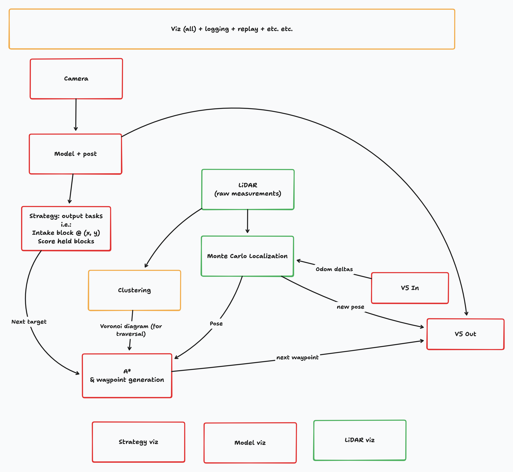
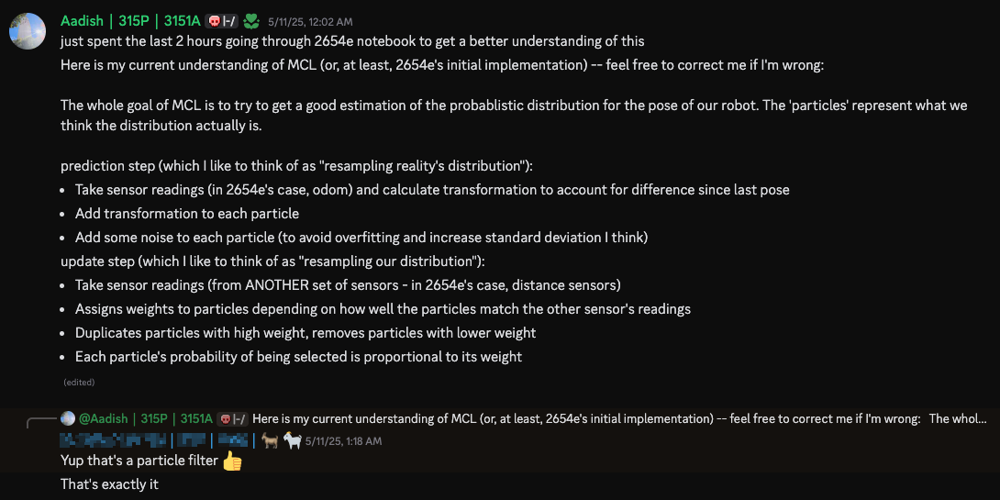

<!-- since its mostly tldraw -->

## Motivation

One of my most popular blog posts is my one on [Monte Carlo Localization](/mcl), which VEX competitors from Australia to Thailand still use to help their understanding of MCL. Even today I routinely get thanks for writing it (and my subsequent [follow-up](/mcl-2x) that went into more detail on resampling).

Most of my knowledge about MCL comes from implementing it myself. In this blog, I'll be focusing on my implementation of an efficient, GPU-accelerated MCL pipeline running on a RPLiDAR A1 and Jetson Orin Nano.

## Background

When I started planning 3151A's high-level architecture for the VEX AI High Stakes season, I knew practically nothing about how the competition and technology worked. I thus wrote a very elaborate plan for how we would orchestrate the robots:

[^1]: funnily enough, I barely knew Rust at the time. All of my knowledge was from doing [Advent of Code problems](/aoc) in it, and I had no idea how the borrow checker etc. worked. I really only got a good intuition for borrowing in ~October 2025. Luckily, 2654E had code examples that were extremely easy to understand. I highly recommend their [notebook](https://www.vexforum.com/t/2654e-engineering-notebook-explanation-video-release/136688) as additional reading!
