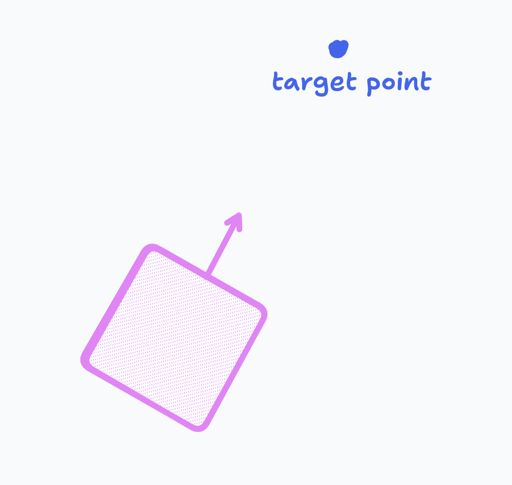

import {CosineViz} from "@/tools/move2point.tsx";


*I'm currently wrapping up a lot of projects, preparing to start a new chapter of my programming journey next week. ~~Barring procrastination~~ expect an influx of blog posts!*

## Why you need this blog post

On my time for the VEX AI Robotics team 3151A, I used the [LemLib](https://github.com/LemLib/LemLib) library for the PROS kernel for my motions and localization. LemLib and similar solutions are often referred to in the VEX community as "templates;" they abstract away significant amounts of functionality (namely, LemLib handles the implementations of motion control and odometry) in exchange for a drastically simpler API.


Hundreds if not thousands of VEX teams use libraries similar to Lemlib to handle motion controls for them. Unfortunately, many competitors, including myself, don't understand the algorithms behind motion control.

> Disclaimer: I'm no expert in control theory! The closest I've gotten to LemLib is [a single open PR](https://github.com/LemLib/LemLib/pull/274), so take my words with a grain of salt.

Unfortunately, a rare Q&A asked *and* answered by the VEX Game Design Committee recently stated that:

> It is the responsibility of each Team to be able **to explain and defend** the design, construction, and **programming** of their Robot if questioned by referees, inspectors, Event Partners, or judges. Teams should be prepared to describe their design process, justify design decisions, and demonstrate a full understanding of how their Robot functions.

In other words, V5RC teams need to be able to explain the programming of their robots.

This can be taken to the extreme, as the rule (and the corresponding [RECF Code of Conduct](https://v5rc-kb.recf.org/hc/en-us/articles/9653987780375-Code-of-Conduct)) are quite ambiguous.


***Exhibit A.** Background: [vexide](https://vexide.dev/) relies on a [VEX SDK jumptable](https://github.com/vexide/vex-sdk/tree/main/packages/vex-sdk-jumptable) to do basically anything with the brain.*

[](https://github.com/Gavin-Niederman/student-centered-arcade-drive/)
***Exhibit B.** Background: created by a vexide maintainer. You can only explain all your code if you wrote the bootloader!*

---

Anyways, assuming we have to adhere to rule \<G3> (Use Common Sense), this means that all teams using LemLib need to be able to explain what each of their calls to LemLib does. Like I previously said, however, many teams aren't able to do so! In this blog post, I'll try to explain how most of the LemLib motions work.

## Prelude: a brief overview of PID

Before we continue, a necessary prerequisite is understanding PID control. You can get much better overviews elsewhere but I'll recap here for reference.

PID stands for "Proportion / Integral / Derivative" control, and its goal is to, given an error, return an "output" force which can be applied to reduce the error. They can basically be thought of as a function:

%20%3D%20K_p%20%5Ccdot%20%5Ctext%7Berror%7D%20%5Ccdot%20K_i%20%5Ccdot%20%5Ctext%7Btotal%20error%7D%20%2B%20K_d%20%5Ccdot%20%5Ctext%7Bchange%20in%20error%7D)

TL;DR:

- Track your previous error and the sum (integral) of all past errors.
- PID contains three components:
  - a component proportional to the error. if there's more error, increase the force.
  - a component proportional to the derivative (basically the change in error). if the error is increasing quickly, move quicker; if its decreasing rapidly, slow down a bit (to avoid overshooting).
  - a component proportional to the sum. if it's been constant error for a long time (i.e., the error is stuck), integral increases and we slowly build up force.

PIDs are designed to be used in a wide range of systems, so there needs to be some way to tune them for different cases, leading to the constants. There are [easily available guides online](https://renegaderobotics.org/pid-beginners-guide/) to find how to tune them to optimize the speed and accuracy of your PID, but those are beyond the scope of this part.

[LemLib's implementation of PID is actually quite simple to understand](https://github.com/LemLib/LemLib/blob/e6318a9d7180e2e743bb0298860a7a943edd159a/src/lemlib/PID.cpp#L22C1-L43C2) (only 20 lines!); I highly suggest taking a look to better understand how PID is actually implemented.

### PID is everywhere!

PID underlies most of LemLib's motion algorithms. All angular motions (`turnToHeading`, `turnToPoint`, and their `swingToHeading`/`swingToPoint` counterparts) rely almost entirely on a PID. They compare the robot's current heading to the target angle to get an error which is fed into the controller. For `turnToPoint` and `swingToPoint`, the target angle is calculated from the target point using ✨math✨.

LemLib's `moveToPoint` implementation is more complex, however. It still uses PID, but with a few other components to have a fast, arc-like curve. I'll explore a bit more about how it is implemented in this next section.

## How `moveToPoint` works

Let's go back to the beginning. I want to implement move to point. There are two requirements: it should be **accurate** and **fast.** If it's inaccurate, we're not actually going to the right point. If it's slow, oops! - I just wasted all of the autonomous period going to a single block. I'll explain each step using Rust-like psuedocode.

**Level 0:** Let's say we're pointing at the target point already. That's great!


We want to drive straight forward until we reach the target point -- in other words, we want to minimize the distance between the robot and the target point. If we call this distance the "error," it becomes clear that a PID controller is applicable here! To calculate the error, we can use the distance formula ([Khan Academy reference](https://www.khanacademy.org/math/geometry/hs-geo-analytic-geometry/hs-geo-distance-and-midpoints/a/distance-formula)). Our code so far looks like this:

```rust
// constants:
// maxError: the maximum error you allow for the distance
fn moveToPoint(targetPoint) {
    while error < maxError {
        let error = distance(robot, targetPoint);
        let output = computePID(error);
        driveForward(output);
    }
}
```

We use a `maxError` to let the controller know when it can safely exit; think of it as a way to tune the accuracy/speed balance. If you want to be within 5 units of your target, set `maxError` to 5, etc.

There's a slight issue though: we might not be already pointing at the target. If we are even 1 degree off from the target, we'll drive right past it and never settle, since the output will always be positive (leading to us constantly driving forward) if we aren't close enough to the target.

**Level 1.** Level 0 was mostly warm-up to understand PID and how to use the distance formula; let's go through actually feasible solutions. The simplest solution to allow us to handle targets with different angles is just to first point at the target, then reuse our code from Level 0. This basically involves running an initial PID to first get us pointing at the target, then another PID (the same as we used in Level 0) to drive to it. These are referred to as the "angular PID" and "lateral PID", respectively. Here's a diagram, with the angular error annotated:


```rust
// we now have two PID functions: computeLateralPID and computeAngularPID
// constants:
// maxLateralError: the maximum error you allow for the distance
// maxAngularError: the maximum error you allow for the angle before we start driving to the target
fn moveToPoint(targetPoint) {
    while abs(angularError) < maxAngularError {
        // assume angularError is from -180º - 180º
        let angularError = angleFrom(robot, targetPoint);
        let output = computeAngularPID(angularError);
        driveTurn(output);
    }
    while error < maxLateralError {
        let error = distance(robot, targetPoint);
        let output = computeLateralPID(error);
        driveForward(output);
    }
}
```

This is already a massive improvement, since we'll probably get *somewhere* close to the target (hopefully!). However, if there is an obstacle on the route, or if we aren't pointing *exactly* at the target, or if the drivetrain has drift/is overheating, etc., we might end up skewing sideways! Here's an example of such a "near miss:"


**Level 2.** What if we detected when we starting to deviate from our path? Then, we could stop, turn to the point again, and continue.

But how would we determine if we've from the path? Doing so is actually a nontrivial process. One option is that we could recalculate `angularError = angleFrom(robot, targetPoint)`, but that would require tuning another constant, like so:

```rust
// constants:
// acceptableAngularError: the angular error which is okay from deviations from the path
fn moveToPoint(targetPoint) {
    while lateralError < maxLateralError {
        let deviatedFromPath = angleFrom(robot, targetPoint) > acceptableAngularError;
        if deviatedFromPath {
            while abs(angularError) < maxAngularError {
                // assume angularError is from -180º - 180º
                let angularError = angleFrom(robot, targetPoint);
                let output = computeAngularPID(angularError);
                driveTurn(output);
            }
        }
        let error = distance(robot, targetPoint);
        let output = computeLateralPID(error);
        driveForward(output);
    }
}
```

That's annoying to tune, and also not fast; turning, driving, stopping, turning again, etc. is very slow due to the repeated full stops. Time to do some speeding up...

**Level 3.** What if, instead of doing turns and forward motion in entirely seperate stages, we do them simulatenously?! This sounds weird, but it makes sense if you've used arcade drive before. Arcade controllers basically allow us to simulatenously execute turning and straight motion on a tank drivetrain, using the following:
```rust
fn driveArcade(straight, turn) {
    moveLeftSide(straight - turn);
    moveRightSide(straight + turn);
}
```
This has an issue which we'll discuss later, but it makes combining the two motions trivially; we can
1. calculate angular and lateral error
2. plug them in to our respective PIDs to get angular and lateral velocity commands
3. plug those into our arcade function to get left and right motor commands and move the drivetrain.

```rust
fn moveToPoint(targetPoint) {
    while lateralError < maxLateralError {
        let lateralError = distance(robot, targetPoint);
        let lateralOutput = computeLateralPID(lateralError);
        let angularError = angleFrom(robot, targetPoint);
        let angularOutput = computeAngularPID(angularError);
        driveArcade(lateralOutput, angularOutput);
    }
}
```
This looks great! Now, we can start moving forward even while we are still turning towards the target point. This produces the expected smooth curving motion. Also, since we're always running the angular PID, the above issue is addressed; angular error at any point in the motion is immediately resolved.

Is this the holy grail of move to point algorithms? No...

Suppose we have a robot that's facing about 90 degrees away from the target point. Initially, going forward at all would be a *bad* idea since it actually brings the robot farther away from the targt. Unfortunately, our `moveToPoint` function doesn't know that, so it starts driving forward. It thus takes a lot longer for the turn to execute and redirect the robot all the way back. An example of the resulting elongated arc motion is below, with the ideal curve in light blue.


**Level 4.** Ideally, we'd decrease the lateral PID output if the robot is facing too far away from the target point. To do this, we can make a minor yet very helpful modification to our code for Level 3. Instead of using the raw distance to the target as the lateral error, we multiply the raw distance *by the cosine of the angular error.*

This may sound arbitrary, but it makes sense when you consider the behavior of the cosine function: when the input (a.k.a. angular error) is near 0, cosine is near 1, so when the robot is pointing pretty close to the target, the lateral error is higher and it can start driving forward faster. If the input is closer to 90º, cosine is near 0, so the robot will slow down if it needs to turn.

Feel free to play around with the below widget to get a feel for how the cosine function works. It shows the relevant right triangle; the highlighted dark blue leg represents the magnitude of the cosine value.

<CosineViz client:load />

Note that, if the angular error is obtuse, the cosine is negative. This is unintended as it will negate the lateral error, leading to the robot driving backward. A key guarantee of LemLib's `moveToPoint` implementation is that it only ever moves forward (unless the `reversed` flag is set, of course), so we just set lateralError is 0 if the angular error is negative -- in other words, we don't start driving forward until we are at most facing 90 degrees away from the target.

And our updated code:

```rust
fn moveToPoint(targetPoint) {
    while lateralError < maxLateralError {
        let angularError = angleFrom(robot, targetPoint);
        let angularOutput = computeAngularPID(angularError);

        let lateralError = distance(robot, targetPoint) * cos(angularError);
        if abs(angularError) > 90º {
            lateralError = 0;
        }
        let lateralOutput = computeLateralPID(lateralError);

        driveArcade(lateralOutput, angularOutput);
    }
}
```
This is commonly known as cosine scaling.

This is great! We now have super smooth, curving arc motions that go straight to our target point. Alas, there are still myriad edge cases that we need to consider.

**Level 5.** Let's look back at our `arcade` function:

There is a subtle bug here, known as oversaturation. If both `straight` and `turn` are very high (close to the maximum motor power), the input to `moveRightSide` (or `moveLeftSide`, if `turn` is very large) will be greater than the maximum motor power. This won't break the motors (luckily), but it will cause the powers to get clamped to the maximum. This leads to the turn amount being less than expected. To avoid this, we can scale down (*`desaturate`*) both side's power if either is too large. This way, even if the robot moves a bit slower, the turning radius will be more accurate. Here's a helpful diagram from a [LemLib issue](https://github.com/LemLib/LemLib/issues/66):


The change looks like this:
```rust
fn driveArcade(straight, turn) {
    let left = straight - turn;
    let right = straight + turn;
    let max = max(abs(left), abs(right));
    if max > MAXIMUM_MOTOR_POWER {
        left *= MAXIMUM_MOTOR_POWER / max;
        right *= MAXIMUM_MOTOR_POWER / max;
    }
    moveLeftSide(left);
    moveRightSide(right);
}
```
(No changes to `moveToPoint` are required.)

LemLib has an equivalent [`desaturate`](https://github.com/LemLib/LemLib/blob/e6318a9d7180e2e743bb0298860a7a943edd159a/src/lemlib/util.cpp#L42C1-L48C2) function used in their move to point implementation.

One bug squashed... just one more to go.

**Level 6.** If you played around enough with the above cosine scaling widget, you might have noticed something peculiar: if the robot is very close to the target point, any slight movement can result in drastic changes to the angular error. The closer the robot gets, the more unreliable turning is. By the time we get to the target point, the robot is basically turning unpredictably. This is obviously not good.

There are a bunch of interesting ways to address this, but the simplest is to disable turning when the robot is within a certain threshold distance of the target point. The implementation is relatively simple. We set `angularError` to zero instead of `angularOutput` so that the cosine scaling doesn't get messed up either:
```rust
// constants:
// stopTurningError: the distance at which to effectively disable turning. in LemLib, this is set to 7.5in.
fn moveToPoint(targetPoint) {
    while lateralError < maxLateralError {
        let angularError = angleFrom(robot, targetPoint);
        if distance(robot, targetPoint) < stopTurningError {
            angularError = 0;
        }
        let angularOutput = computeAngularPID(angularError);

        let lateralError = distance(robot, targetPoint) * cos(angularError);
        if abs(angularError) > 90º {
            lateralError = 0;
        }
        let lateralOutput = computeLateralPID(lateralError);

        driveArcade(lateralOutput, angularOutput);
    }
}
fn moveToPoint(targetPoint) {
    while lateralError < maxLateralError {
        let angularError = angleFrom(robot, targetPoint);
        let angularOutput = computeAngularPID(angularError);
        let lateralError = distance(robot, targetPoint) * cos(angularError);
        let lateralOutput = computeLateralPID(lateralError);
        driveArcade(lateralOutput, angularOutput);
    }
}
```

These together form the key components of LemLib's move to point implementation. To summarize, the final implementation involves:
1. Combined lateral and angular PIDs,
2. with lateral output scaled by the cosine of angular error,
3. with angular output disabled when lateral error is below a threshold,
4. combined via a desaturating arcade function.

Let's see how LemLib does it.
## Code walkthrough

The LemLib code is pretty verbose and uses a lot of LemLib-specific utils, so I'll add pseudocode as needed.

> Note: all code was accessed from LemLib's `master` branch on Sep 25, 2025. Most teams will use a LemLib binary compiled from the `stable` branch, but implementations likely do not differ significantly. [Permalink](https://github.com/LemLib/LemLib/blob/e6318a9d7180e2e743bb0298860a7a943edd159a/src/lemlib/motions/moveToPoint.cpp)

todo!

## Conclusion

Hope this helped :D

I might write up another post in this series in the future, focusing on more advanced controllers (boomerang controller, and cross-track error based algos). Let me know if you'd be interested!

## Sources

1. [5. Angular Motion | LemLib docs](https://lemlib.readthedocs.io/en/stable/tutorials/5_angular_motion.html)
2. [6. Lateral Motion | LemLib docs](https://lemlib.readthedocs.io/en/stable/tutorials/6_lateral_motion.html)
3. [LemLib/src/lemlib/PID.cpp](https://github.com/LemLib/LemLib/blob/master/src/lemlib/PID.cpp)
4. [LemLib/src/lemlib/motions/moveToPoint.cpp](https://github.com/LemLib/LemLib/blob/master/src/lemlib/motions/moveToPoint.cpp)

Thanks to Nasir | 934Z, GrkDev | 23880A, andrew | 781x, and Liam | TNTN (creator of LemLib!) from VTOW for helping me review this post before publication!
Image credits for the oversaturation diagram to tropix126 (Nathaniel | AUBIE1 of VTOW) in the linked LemLib issue.
