<!--TODO: dig up and link all Gemini sessions-->

## Motivation

Apple Music, in the fullscreen view for playing music, shows an animated, flowing gradient in the background that appears to sample colors from the playing song's album art.

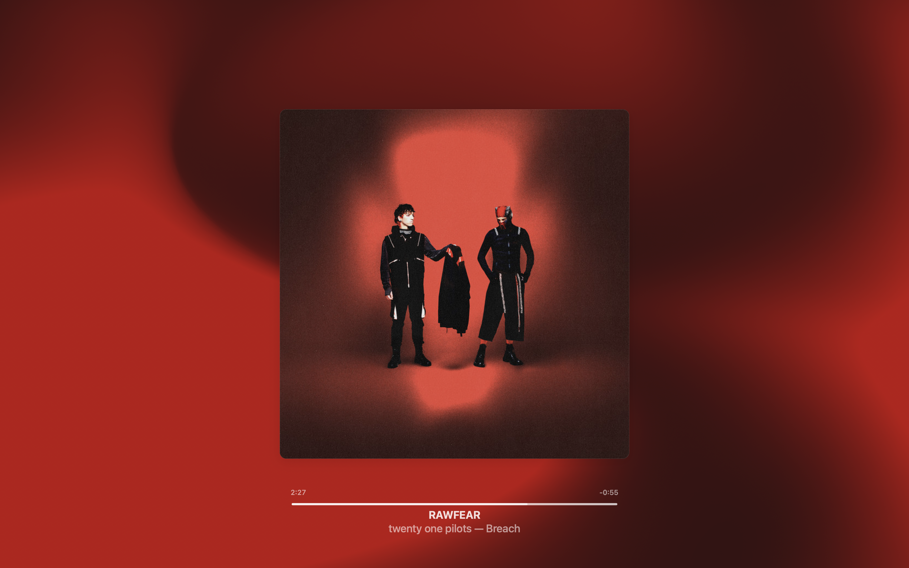

I spent a lot of time trying to figure out how this could work before giving in and actually doing a bit of research into it. I ended up going down a multilayer rabbit hole (as most of my projects end up in) to reproduce it myself.

<aside>
    <b>Use of AI:</b> no AI-generated code ended up the final version of this project (although tab complete through Zed's Edit Predictions was used). This task is actually surprisingly difficult for LLMs -- I tried to get OpenCode with gpt-5-mini and grok-code-fast-1 to do similar work to what I describe in the rest of this post, and they both failed. I think a big reason for this is context, which was very pervasive as the files I'm discussing are in the 12k LOC range. Even using tricks like subagents doesn't fully resolve the problem.
    <br /><br />
    However, I *did* use AI to help me with my research. All queries were conducted on the Google Gemini app with Gemini 2.5 Pro. I chose to go this route because the actual work with the code is very appealing to me, but doing all of the auxiliary research, not as much. Queries ranged from simple ("how does X API work?") to much more complex "explain how X effect is implemented in Y shader language, taking into account Z's implementation"). I occasionally asked Gemini to generate example code but never just pasted it in. Share links to all of my Gemini conversations will be available at relevant parts of the article.
    <br /><br />
    This is how I'm doing much of my coding nowadays, so I hopefully won't have to post another update like this in a while.
</aside>

This was a relatively short project: I initially started looking into it in the afternoon of October 20...

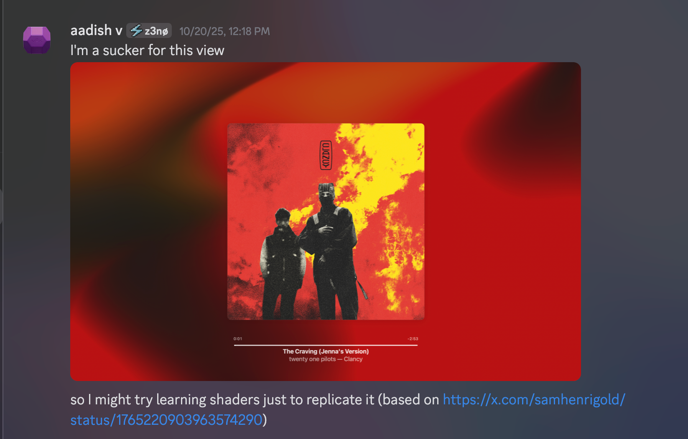

...and wrapped up in the evening of October 25. The vast majority of actual work that contributed to the final project was actually done in the last two days, which ought to give you a sense of how finnicky these projects are. There are still things which my reproduction doesn't do which drive me crazy, but that's for later.

## Initial exploration
This all started off with a message I sent to Gemini on a whim, after doing about 5 minute of googling:
> Any good analyses of how the full-screen background works in Apple Music?
>
> i.e. https://www.reddit.com/r/AppleMusic/comments/k6434f/til_apple_music_on_macos_has_a_fullscreen_view/

Gemini managed to dig up [this wonderful thread from developer/designer Sam Henri Gold](https://x.com/samhenrigold/status/1765220903963574290), which is the key resource I used for practically the entire project. It notably does *not* work by sampling colors from the album art and blending them, as most gradients of this type do; here's how Sam explains it:

> Some background on this: the visualizer is one of those mesh/fluid gradients that designers have been swooning over for a couple of years now.
>
> the way they’ve constructed theirs is by layering copies of the artwork and “twisting” each copy [and then layering a blur shader on top]. All done in a Metal shader.
>
> the actual twist effect itself works something like this: it distorts coords within some radius around an offset by applying a rotation whose angle increases with distance to the offset. the rotation angle is modulated by a squared ratio of the distance to the radius.

This is quite smart; the notable advantage is that *all* of the functionality of the gradient can be implemented as a series of fragment shaders. There are three key steps:
1. overlaying several moving copies of the album art
2. applying the "twist" effect described
3. applying a Gaussian blur.

At the time, though, I didn't fully understand the idea (mainly because I didn't even know how shaders worked), so I shot off a DM to Sam:

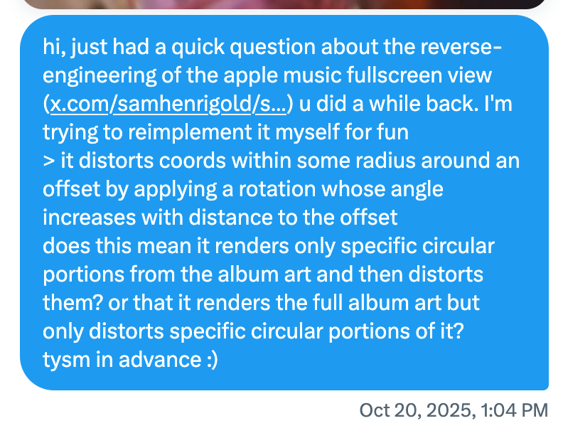

At the time of writing, Sam hasn't replied. I was on my own.

Also note that there are a huge number of associated configurable constants -- how many copies of the artwork, the sizes of each copy, the speed at which they moved, the standard deviation of the gaussian blur, the blur kernel size, twist angle, twist radius, number of twist effects, etc. etc. I had no idea what these should be either.

I decided the best way to resolve both of the issues (ambiguity with how the effect worked, and choice of constants) was to reverse-engineer the Apple Music app myself. This wasn't easy, considering I was basically trying to debug a proprietary app on a proprietary platform, both owned by Apple, which has of course built in many safeguards to prevent reverse engineering.

Gemini threads:
* [finding the original tweet by Sam](https://gemini.google.com/share/2e0c1b7be439)
* [initial research into how I could do similar debugging](https://gemini.google.com/share/d1f9007175f5)
* [trying to use FLEX in a simulator](https://gemini.google.com/share/c75a4691c69a)
* [more questions about FLEX compatibility](https://gemini.google.com/share/44ea59f9b19d)


## Trying to reverse-engineer the desktop app

I first looked at how Sam had done his research: [he had used FLEX](https://x.com/samhenrigold/status/1765580542735483176), which is basically the equivalent of DevTools for iOS. However, FLEX requires an iPhone, and the iPhone needs to be jailbroken. I unfortunately do not have an iPhone, let alone a jailbroken one. I thus turned to the Xcode debugger as a last resort. Xcode wasn't the hail mary it may seem to be: it was extremely slow, had safeguards built in to avoid debugging Apple apps, and often froze in the middle of debugging. But it was a start.

Xcode has two main ways to debug an external app: to load in its executable, or to attach to a running process. When using the former, Apple Music generally could immediately detect it was running in a debug environment and crash itself:

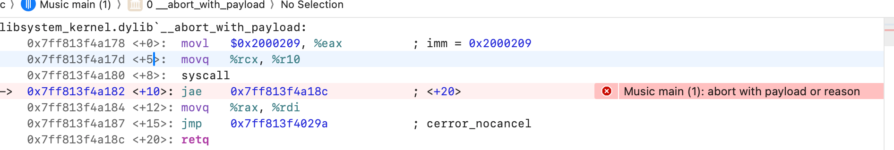

so I mostly used the latter. This enabled me to debug Apple Music for several minutes (and, of course, much longer if/when I paused it), although it did occasionally still crash after detecting the deubgger. This was enough to start doing basic work, though.

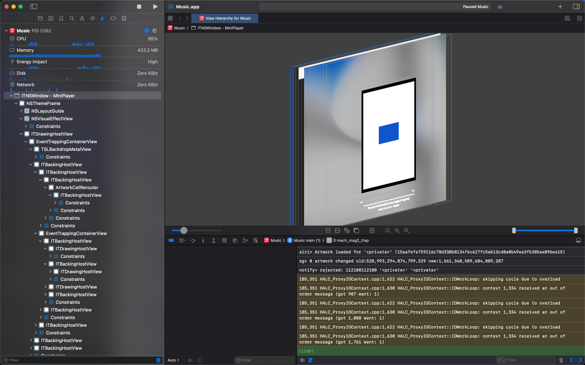

My main goal here was to disable the blur shader used, so that I could get a better internal look at how the effect worked, similar to what Sam had done.

Gemini recommended I use the Metal capture system builtin to Xcode to debug the shaders. Unfortunately, the capturing button was disabled, I assume as a result of me debugging a first-party app.

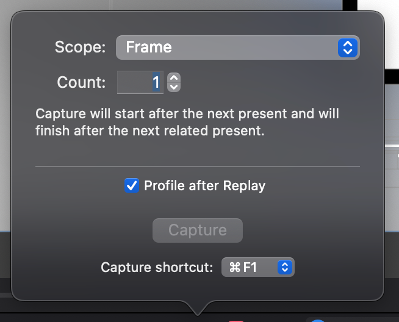

I reviewed Sam's FLEX demo again and noticed he didn't do anything Metal-specific -- rather, he found the blur object in the heap and directly edited its sigma value. I tried to do something similar using the LLDB debugger, but inevitably ran into issues.
I was able to find the object:

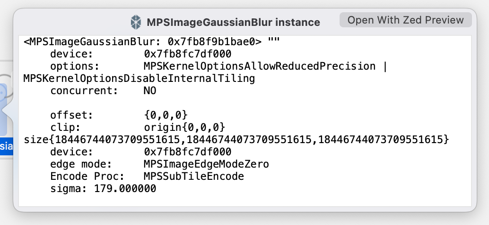

But LLDB would complain something along the lines of

```
$ expr ((MPSImageGaussianBlur *)$test).sigma = 0.00
error: <user expression 20>:1:39: no setter method 'setSigma:' for assignment to property
1 | ((MPSImageGaussianBlur *)$test).sigma = 0.00
```

Gemini suggested a lot of other methods to get around this, such as injecting a dynamic framework to swizzle the MPSImageGaussianBlur initializer to set the sigma to zero, but they didn't end up panning out.

This part of the project lasted around 3 days itself. I started growing concerns around the second day that it wouldn't work, so I decided to go another route.

Gemini threads:
* [installing FLEX tweaks on a simulator](https://gemini.google.com/share/53b14ba7f92d)
* [identifying how Sam used FLEXList](https://gemini.google.com/share/3290dac202ff)
* [editing heap objects in LLDB](https://gemini.google.com/share/cee88b64021a)
* [trying to swizzle the app to make sigma always 0 in MPSGaussianBlur](https://gemini.google.com/share/b88c693a0368)
* [more fighting LLDB](https://gemini.google.com/share/dc69c37529aa)


## Reimplementing from scratch

At this point, I concluded that the fastest route to answer my questions would be to write the effect myself and then tune it until it matched the Apple Music one.

I initially decided to try using WGPU and WGSL since my graphics-nerd friends recommended it (and also because Rust = ⚡blazing fast⚡), but quickly burned out after it took about 200 lines of code to draw a triangle, and 350 for a simple image. The concept of textures/fragment shaders/vertex shaders weren't super clear to me at the time, either, which probably added to the confusion.

<aside>
    For those who are wondering, vertex shaders are called multiple times to return points which form lines/points/triangles/etc. For each shape, the fragment shader is then called at each pixel (in the canvas coordinate space) to choose a certain color. Textures are used to store images and intermediary frames, and are often used paired with framebuffers.
</aside>

I decided to try using WebGL instead on a whim, which led to the fumble of the century:

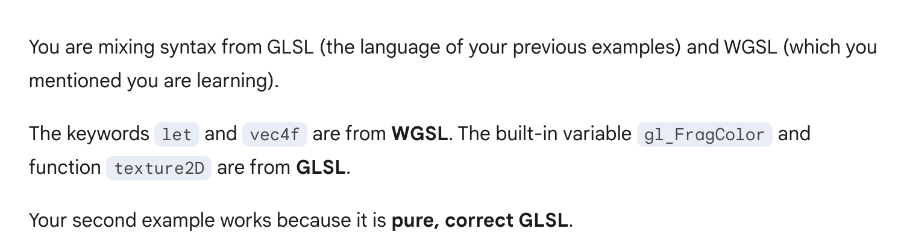

Yeah, I completely didn't realize that WebGL and WebGPU were entirely different things and used their own separate shader languages. After getting acclimated, though, I managed to port a basic program to TypeScript with WebGL. And it was so much simpler 😅

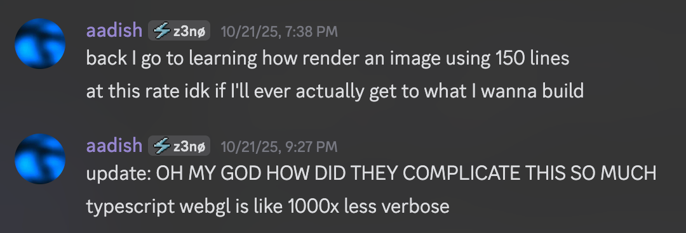

I used [this tutorial](https://webglfundamentals.org/webgl/lessons/webgl-image-processing.html) to figure out how to render images and also as a good source of truth for how WebGL works in general. I jumped in headfirst without reading any prior parts of the tutorial, which might have been a mistake, but oh well.

The development itself was relatively boring, but after a day or two of coding I ended up with [this TypeScript code](https://github.com/aadishv/html-music/blob/3fc5b22481ed8e86799df64592416f8ca3290931/app.ts) which implemented all of the needed effects. It looked like this (again, using the Breach album art for the demo):

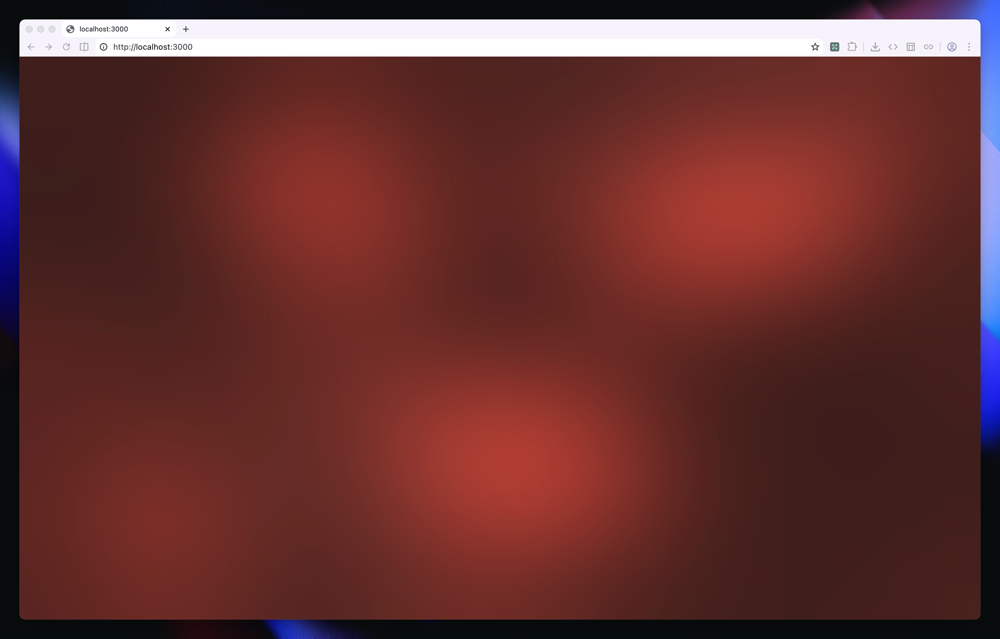

It was relatively good, but not yet perfect:

1. I didn't know how to properly handle moving the image copies. My logic at the time just "respawned" images when they went out of frame by moving them back to a random position and moving them to the very back of the stack. This fell apart when there were too few copies, though, or when multiple copies went out of frame at once, leading to "jumps" between frames.
2. The Apple Music background (see the top of this article) seemed way more saturated, which confused me as I wasn't doing anything particular to desaturate the colors.
3. Just tuning the constants was very hard! I had no idea how the copies were positioned, their size, how quickly they moved, how many twist effects there were, the radius/theta of each effect, etc.

Gemini threads:
* [learning about Gaussian blurs & their optimizations](https://gemini.google.com/share/a23b2bafb021)
* [looking into WGPU](https://gemini.google.com/share/f0063ead2f82)
* [finding tutorials for loading images into WebGL](https://gemini.google.com/share/ca4f9ab96877)
* [understanding WebGL behavior](https://gemini.google.com/share/d4acb634892e)
* [figuring out how to implement multi-pass rendering](https://gemini.google.com/share/e96cc5967896)
* [understanding buffers](https://gemini.google.com/share/d719ac0d77e0)
* [writing a quick TypeScript function to generate a Gaussian kernel](https://gemini.google.com/share/ebfc4e0d5911)
* [learning that GLSL ES 1.00 has mid array support](https://gemini.google.com/share/e38ab8ebc491)
* [learning more about vertex shaders](https://gemini.google.com/share/393c2a3aa544)

## Reverse engineering the web app

It was at this point that I realized the obvious thing, which was that Apple Music Web had a very similar view. It's not the exact same as the MacOS app's background, which I'll talk a bit more about later, but it was close enough to continue with.

I initially searched for general terms I might expect to find in a shader -- `varying`, `uniform`, etc. I ended up at a particular [bundle file](https://github.com/aadishv/html-music/blob/e9d8026e5c823e3782dee453654b5de1e2f34655/sandbox/bundle.js) (I don't remember the exact name) which contained code that I could definitely identify as manipulating WebGL instances and creating shaders. I thus copied this into Zed and began to reverse engineer. 

This wasn't trivial, as the file itself was over 12,400 lines of untyped, minified JavaScript. The minification meant that no variable or class names remained, making it very hard to understand what was going on; unfortunately, Apple remembered to not include source maps, unlike [the recent incident with the App Store web app](https://news.ycombinator.com/item?id=45804664).

After manually hunting around a bit I compiled a list of shaders. There were a few common ones like one to apply a transformation matrix to a texture, and a few specialized ones. Notably, I found the shader which implemented the infamous twist effect!

```glsl
vec2 twist(vec2 coord)
{
    coord -= offset;

    float dist = length(coord);

    if (dist < radius)
    {
        float ratioDist = (radius - dist) / radius;
        float angleMod = ratioDist * ratioDist * angle;
        float s = sin(angleMod);
        float c = cos(angleMod);
        coord = vec2(coord.x * c - coord.y * s, coord.x * s + coord.y * c);
    }

    coord += offset;

    return coord;
}
```

There were a few shaders which confused me, like one that ostensibly did a box blur -- despite my knowledge that Apple Music on Mac used Gaussian blurs -- although I later realized that shader actually ended up being used to implement Kawase blur (which approximates Gaussian blurs).

It was at this point that I actually bothered to scroll to the bottom of the line and read the last line:
```js
export {zh as LyricsScene};
```
This was very important, as it clarified the `zh` class, which was defined immediately above, was the only export of the file, and thus probably the one which could be used to implement the actual functionality.

I looked into the constructor for `zh`:
```js
constructor(t, s) {
    let {height: i, width: r} = t.getBoundingClientRect();
    this.app = new Ti({
        width: r,
        height: i,
        view: t,
        powerPreference: "low-power",
        backgroundAlpha: 0
    });
    const n = new Me;
    n.beginFill(16777215),
    n.drawRect(0, 0, this.app.renderer.width, this.app.renderer.height),
    n.endFill(),
    this.app.stage.addChild(n),
    this.reduceMotionQuery = window.matchMedia("(prefers-reduced-motion: reduce)"),
    this.app.ticker.maxFPS = 15,
    this.initAnimation(),
    this.updateArtwork(s)
}
```
The key things to note here is that `t` is definitely used to provide some "view". I managed to correctly guess that `t` could be a canvas element. Similarly, the definition of `updateArtwork` makes it clear that `s` can be a URL to an image. This was enough for me to set up a basic website to test out the functionality. The following code:
```js
import { LyricsScene } from "./bundle";
const canvas = document.getElementById("canvas");
const scene = new LyricsScene(canvas, "http://localhost:8000/breach.jpg");
```
worked perfectly! 
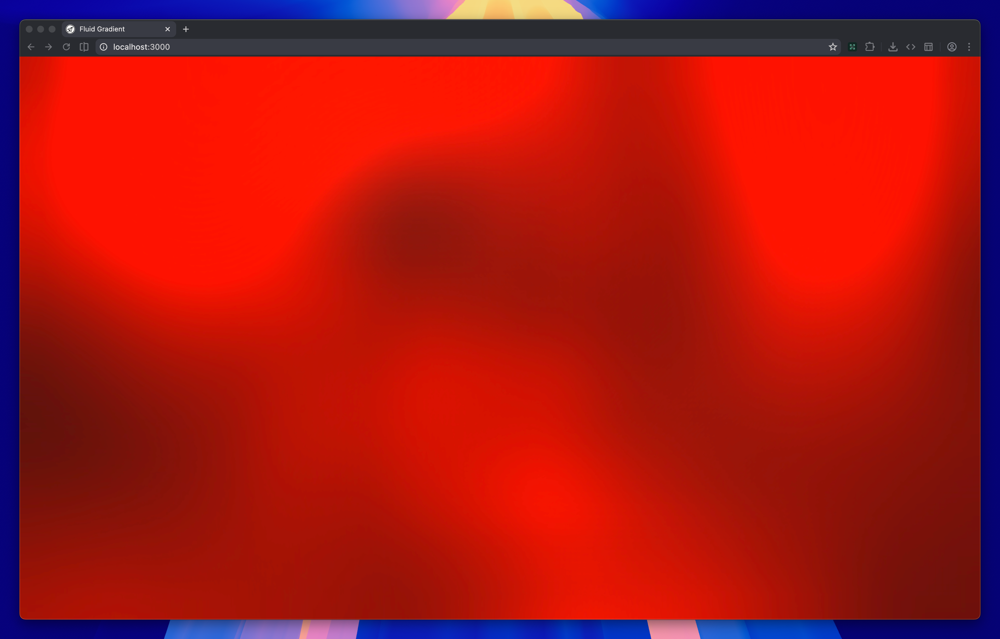

The animation itself, however, was still a black box to me. I could make very broad changes by enabling or disabling full shaders, but otherwise couldn't change the animation at all.

After a lot more poking around, I eventually realized that the vast, vast majority of the file was actually just a minified embedded version of Pixi.js! Pixi is a "wrapper" of sorts around WebGL and similar standards which provides a game engine-like API to access them. After checking the `pixi.min.js` for a few different versions, I matched it to Pixi 7.4.2. After this, the decompilation itself was pretty simple; I just needed to figure out which parts of the code were part of Pixi, remove them, and change references to use the relevant Pixi imports instead.

This took quite a bit of work, basically the entirety of Saturday, but I eventually managed to finish decompiling the code and get a TypeScript reconstruction working! You can see the TypeScript code [here](https://github.com/aadishv/html-music/blob/4ef618ea2638a0c435d23f182f7aa10e30757ef6/bundle.ts). The code itself is less than 100 lines, meaning that the other 12,300 lines of the file were just Pixi.js (and the adjacent `pixi-filters` library which Apple used to get the twist, blur, and saturation effects).

I finally could get a good look inside the inner workings of the animation. It was quite interesting:
* Apple Music oversaturated the album covers to make the gradient more appealing, which I had suspected, but was still cool to see confirmed
* the overlaying of the album art is done through stacking 4 square copies of the album art, sized at 25%, 50%, 80%, and 125% of the viewport width, respectively. The latter (biggest) two only spin in place, while the former (smaller) two spin in place while moving along circular tracks.

This likely isn't how the native animations work (more on this later) but is good enough to get a mesmerizing animation for the web version.

I made a few more tweaks and have put up a demo [here](/tools/music/):

<iframe src="/tools/music/" class="w-full h-[42rem] my-auto mx-auto mt-2"></iframe>

The demo was actually built with Solid, making this my first ever Solid project. It was a quite interesting development experience; I ran into a few weird issues with the stores that led me to just use regular signals, which I think is a result of me not having the full intuition for Solid's mental model, but it was overall very nice! Getting Astro to play nice in a project with both React and Solid was not fun but I managed to get it to work.

Gemini chats:
* [understanding the twist effect](https://gemini.google.com/share/5660c3b7993d)
* [understanding the saturation constants](https://gemini.google.com/share/a2429de30a80)
* [understanding the saturation shader](https://gemini.google.com/share/5aeaf4ca1e95)
* [understanding the blur shader](https://gemini.google.com/share/436c36d71d10)
* [understanding the blur shader (again)](https://gemini.google.com/share/bc7148e9180e)
* [understanding the transformation shader](https://gemini.google.com/share/38e033dc53b0)
* [asking about how the blur was implemented](https://gemini.google.com/share/8736f9855c19)
* [asking about how the `LyricsScene` interface worked](https://gemini.google.com/share/f26489dd8315)
* [asking about parts of the bundle](https://gemini.google.com/share/c019443e39c0)
* [help with Solid](https://gemini.google.com/share/08282096a1a9)

## Conclusion

This was a very fun exploration! I learned a lot about reverse engineering and shaders/WebGL, so I think it was definitely worth the week of work.

It still doesn't perfectly match the native Mac view, which drives me a *little* crazy. Take this example, where the blur on some parts of the background is clearly sharper than that of other parts:

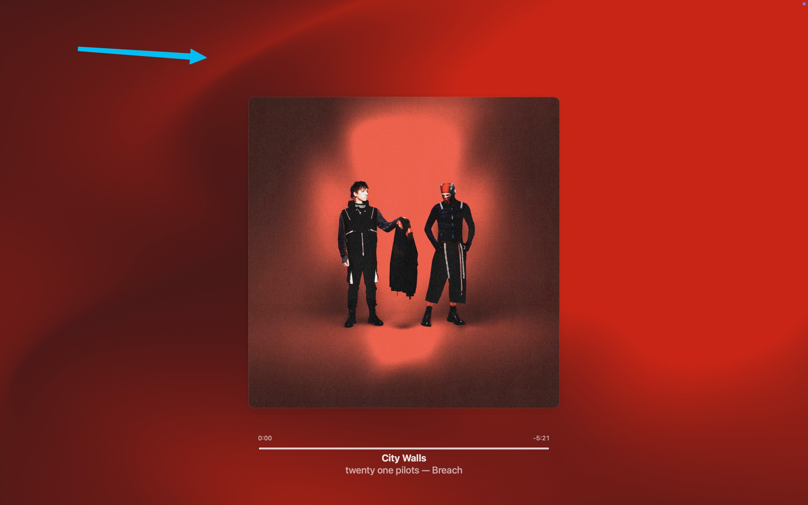

A [chat with Gemini](https://gemini.google.com/share/3eb691bbdf01) seems to suggest there could be some kind of edge-preserving blur at play here, but I'm not sure. 

A few future directions I could take this are actually learning WGPU (despite its verboseness...) and porting the visualization to run natively, perhaps converting the shaders via wgpu's `naga` utility, or porting it to pure TypeScript through the insanely cool [TypeGPU](https://docs.swmansion.com/TypeGPU/). GPU programming is definitely quite interesting and I think I'll explore it more in the future, perhaps implementing more complex programs such as ray tracing.

As always, thanks for reading!

## All Gemini threads

* [finding the original tweet by Sam](https://gemini.google.com/share/2e0c1b7be439)
* [initial research into how I could do similar debugging](https://gemini.google.com/share/d1f9007175f5)
* [trying to use FLEX in a simulator](https://gemini.google.com/share/c75a4691c69a)
* [more questions about FLEX compatibility](https://gemini.google.com/share/44ea59f9b19d)
* [installing FLEX tweaks on a simulator](https://gemini.google.com/share/53b14ba7f92d)
* [identifying how Sam used FLEXList](https://gemini.google.com/share/3290dac202ff)
* [editing heap objects in LLDB](https://gemini.google.com/share/cee88b64021a)
* [trying to swizzle the app to make sigma always 0 in MPSGaussianBlur](https://gemini.google.com/share/b88c693a0368)
* [more fighting LLDB](https://gemini.google.com/share/dc69c37529aa)
* [learning about Gaussian blurs & their optimizations](https://gemini.google.com/share/a23b2bafb021)
* [looking into WGPU](https://gemini.google.com/share/f0063ead2f82)
* [finding tutorials for loading images into WebGL](https://gemini.google.com/share/ca4f9ab96877)
* [understanding WebGL behavior](https://gemini.google.com/share/d4acb634892e)
* [figuring out how to implement multi-pass rendering](https://gemini.google.com/share/e96cc5967896)
* [understanding buffers](https://gemini.google.com/share/d719ac0d77e0)
* [writing a quick TypeScript function to generate a Gaussian kernel](https://gemini.google.com/share/ebfc4e0d5911)
* [learning that GLSL ES 1.00 has mid array support](https://gemini.google.com/share/e38ab8ebc491)
* [learning more about vertex shaders](https://gemini.google.com/share/393c2a3aa544)
* [understanding the twist effect](https://gemini.google.com/share/5660c3b7993d)
* [understanding the saturation constants](https://gemini.google.com/share/a2429de30a80)
* [understanding the saturation shader](https://gemini.google.com/share/5aeaf4ca1e95)
* [understanding the blur shader](https://gemini.google.com/share/436c36d71d10)
* [understanding the blur shader (again)](https://gemini.google.com/share/bc7148e9180e)
* [understanding the transformation shader](https://gemini.google.com/share/38e033dc53b0)
* [asking about how the blur was implemented](https://gemini.google.com/share/8736f9855c19)
* [asking about how the `LyricsScene` interface worked](https://gemini.google.com/share/f26489dd8315)
* [asking about parts of the bundle](https://gemini.google.com/share/c019443e39c0)
* [help with Solid](https://gemini.google.com/share/08282096a1a9)
