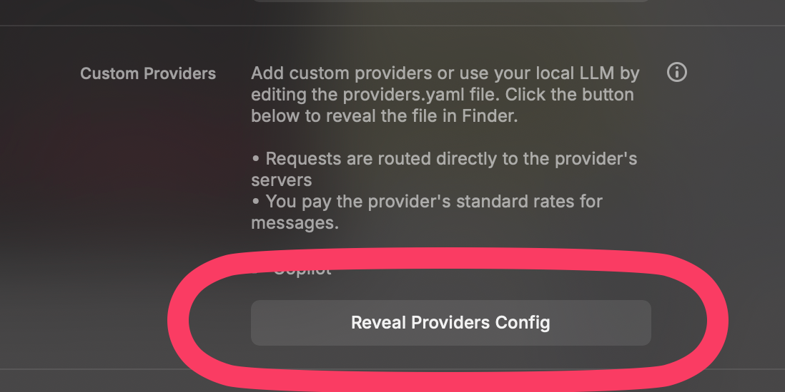

## I'm broke

I'm a student. In other words, I don't have the money to pay for yet another AI chat app. But [Raycast](https://www.raycast.com/) is an essential tool I use daily, and their [Raycast AI](https://www.raycast.com/core-features/ai) offering is appealing to me as a fast way to chat with a model.

Just one small problem -- you have to pay a subscription for it...

Interestingly, Raycast recently introduced [Bring Your Own Key](https://www.raycast.com/changelog/1-100-0) which looks pretty cool, but it only supports a few select providers. I tried Gemini for a bit and quickly hit rate limits on the free tier  of the API; I tried [gpt-oss-20b (free)](https://openrouter.ai/openai/gpt-oss-20b:free) from OpenRouter and somehow obtained a negative balance. Not the best luck.

## Getting Copilot working

One of the main places I often rely on for free programmatic access to models is Github Copilot, which has endpoints for all of the models it hosts for users. Of course, these endpoints are private, but I've seen many tools reverse engineer them, notably [Opencode](https://opencode.ai/), [Chatwise](https://chatwise.app/), and [Zed](https://zed.dev/).

Alas, Raycast doesn't easily support Copilot as a custom model provider:


Luckily, hacking together a few other things happens to work super well!

The first thing to note is that Raycast [very recently added support for Bring Your Own Models](https://www.raycast.com/changelog/1-102-0), released under the name of "Custom Providers." It basically lets you hook up a custom OpenAI API-compatible endpoint base and handles the rest for you. There are a few caveats that I'll get into later but it suffices.

To get an OpenAI API-compatible endpoint I used the fabulous [ericc-ch/copilot-api](https://github.com/ericc-ch/copilot-api) ([blog post](https://dev.to/ericc/i-turned-github-copilot-into-openai-api-compatible-provider-1fb8) on how it was made). Extremely simple to set up, since it has clear instructions after running:
```sh
bunx --bun copilot-api start
```
(Yes, the `--bun` is necessary, I'm not sure why.)
It then exposes an OpenAI-compatible endpoint at `http://localhost:4141/`. Unfortunately, that's not the end of our troubles.

Raycast's Custom Providers implementation doesn't natively support automatically fetching model lists -- so we have to provide our own custom one. Luckily they provide a pretty easily accessible YAML configuration file with examples. So, like any other tech bro would have done, I fetched `http://localhost:4141/models`, pasted the raw JSON into Gemini, and asked it to generate YAML based on the example. And it cooked!


It did get a few things wrong -- the provider prefixes (`openai/`, `anthropic/`, etc.) aren't supposed to be in the model IDs which stumped me for a bit, but after removing them it worked well. I gutted most of the models to just ones that I might find useful, ending up with the following config:
```yaml
providers:
  - id: copilot
    name: Copilot
    base_url: http://localhost:4141/
    models:
      - id: gpt-4.1
        name: "GPT-4.1"
        context: 200000
        abilities:
          temperature:
            supported: true
          vision:
            supported: true
          system_message:
            supported: true
          tools:
            supported: true
      - id: gpt-5-mini
        name: "GPT-5 mini"
        context: 200000
        abilities:
          temperature:
            supported: true
          vision:
            supported: true
          system_message:
            supported: true
          tools:
            supported: true
      - id: gpt-5
        name: "GPT-5"
        context: 200000
        abilities:
          temperature:
            supported: true
          vision:
            supported: true
          system_message:
            supported: true
          tools:
            supported: true
      - id: grok-code-fast-1
        name: "Grok Code Fast 1 (Preview)"
        context: 200000
        abilities:
          temperature:
            supported: true
          vision:
            supported: true
          system_message:
            supported: true
          tools:
            supported: true
      - id: claude-sonnet-4
        name: "Claude Sonnet 4"
        context: 200000
        abilities:
          temperature:
            supported: true
          vision:
            supported: true
          system_message:
            supported: true
          tools:
            supported: true
```
Note my choice of models -- predominantly OpenAI models! I see increasingly less reasons to use Claude given how good (and cheaper) GPT-5 mini is for the same tasks, and I haven't used Grok Code Fast 1 enough to form a good opinion on it. GPT-4.1 is still a workhorse for tasks that require quick responses and/or tool calling. This will be the focus of one of my upcoming posts on AI.

To use this config, open Raycast settings, go to the AI tab, scroll to the bottom "Experiments" section, and enable Custom Providers.


Then, scroll up to the newly added Custom Providers section and click "Reveal Providers Config" to locate and open the YAML file where you can paste in this config.



Now, Copilot models ought to be available via the model picker. (Make sure you're running the copilot-api process in a terminal window or similar!)


Beautiful. Let's try using it to search now...

## Caveats

Among the already obvious caveats (having to update config for new models, having a background process running, etc.), the biggest one is that it doesn't have access to web search.


I have no idea why, but I do have a few theories. They're outlined in [this issue comment](https://github.com/ericc-ch/copilot-api/issues/78#issuecomment-3273687536).

After spending a lot of time trying to work around it, I found a pretty good intermediary. By using the [Exa Search](https://www.raycast.com/exa_ai/exa-search) Raycast extension, it provided a free tool to the model to run searches, separate from the built-in Raycast web search. This ended up working well (I do have to explicitly tag `@exa-search` in every query, but it's not the end of the world). It's definitely pretty slow (up to ~7 seconds per query!) but, well, it works. Here's an example of using it:


No API key required either, which makes it simple to set up.

## Why would I use this?

Good question -- Google AI Mode is faster and looks at dozens of websites; the Copilot website itself provides a chat experience; where does Raycast AI fit in? I find two main uses of it:
* **AI extensions**: Raycast extensions that also expose themselves as tools to the model. Exa Search is an AI extension, but there are many more useful ones.
* **Fast chats**: I often don't have a browser open for whatever reason, or want to just chat with GPT-5 about something without needing to go to the Copilot website. Having the fast native Raycast experience is great in those cases.

Here's another cool example of using AI extensions:


Overall, I'm happy I managed to get this to work -- not the most elegant solution, but its nice for when I need it.

## Update 9/15/25: It works with Codex!

By setting it up as a custom provider, I can use my choice of models from Copilot in OpenAI's Codex CLI as well, without having to spend a penny on OpenAI credits. This can be achieved simply by putting the following in `~/.codex/config.toml`:
```toml
model = "gpt-5-mini"
model_provider = "copilot"

[model_providers.copilot]
name = "Copilot"
base_url = "http://localhost:4141"
```


I don't know if I'll be using this much -- it's great at hallucinating APIs because it doesn't have any easy url context/fetch tool -- but its cool for smaller changes/prototyping.
