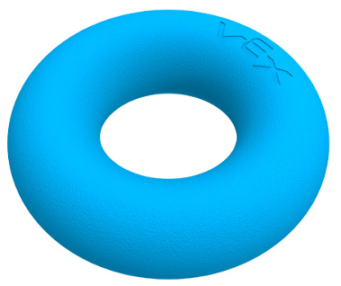
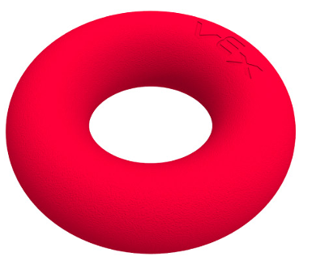
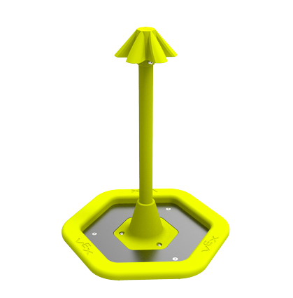
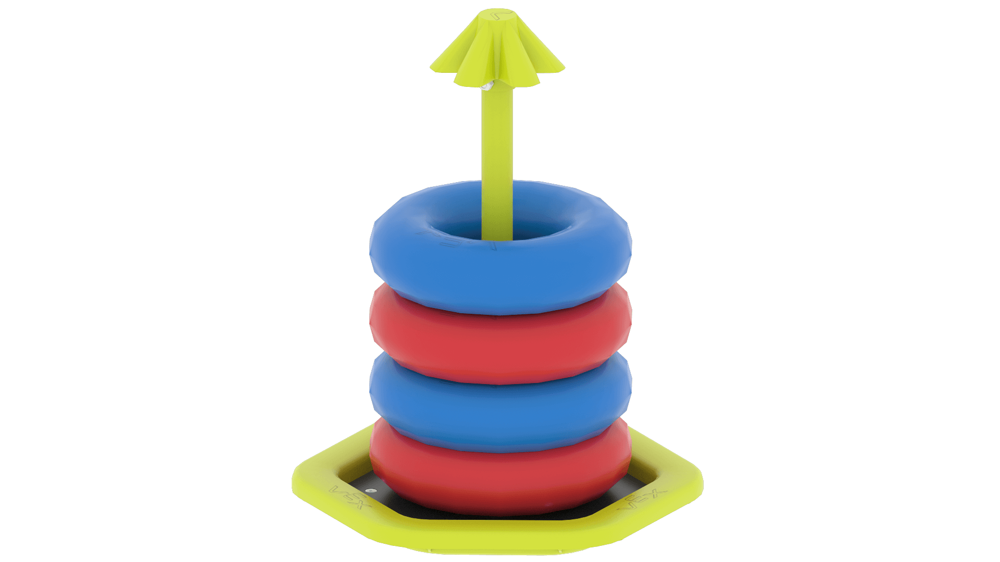
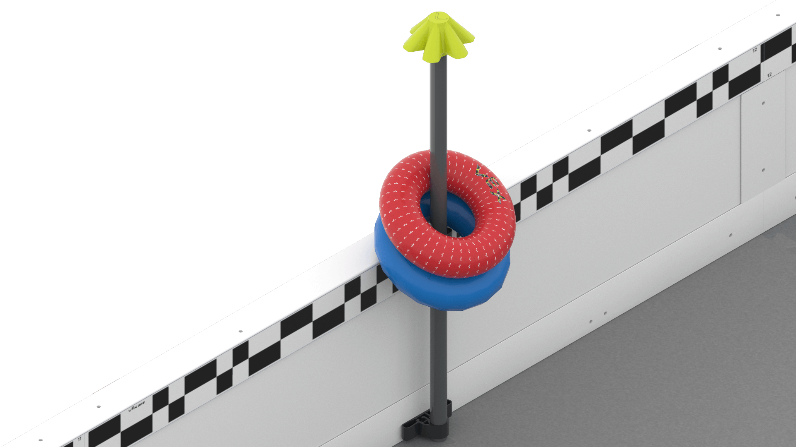
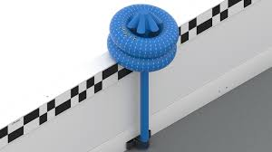
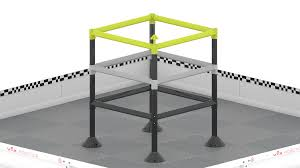
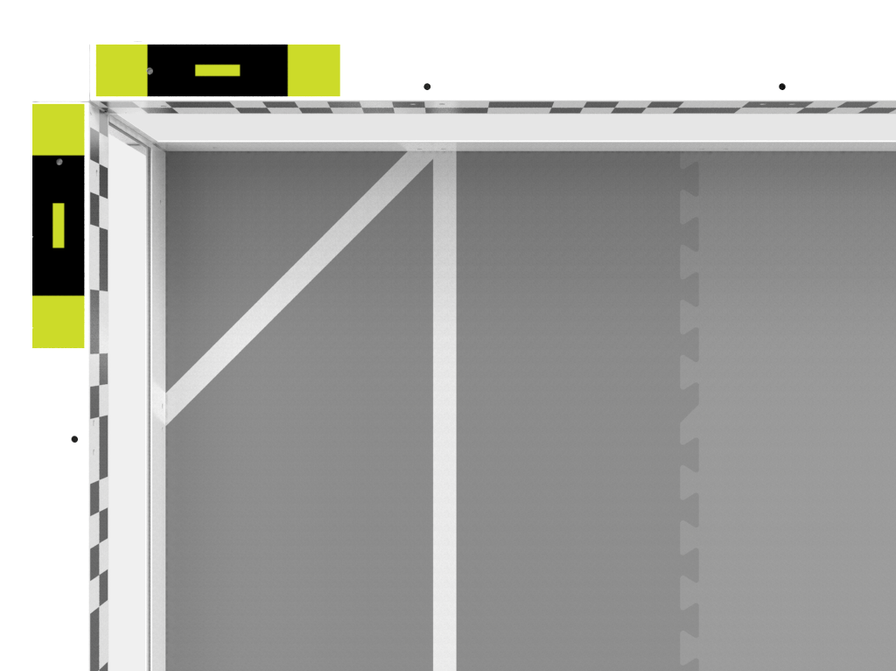
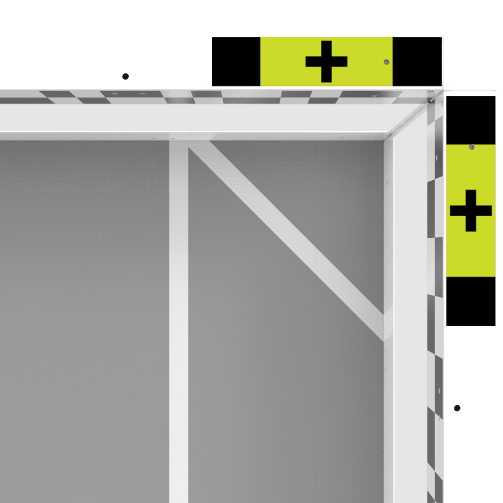

This is the third part of what will eventually be a four- or five-part series. This third part is about my time on 3151A for the High Stakes season. I will be writing at least two more posts as there is just so much stuff to go over.

Here are the previous posts:

* [Robotics 1: 315P (Over Under)](/robotics-1)
* [Robotics 2: 315P (High Stakes)](/robotics-2)

This is a **non-technical post.**
## Background
After leaving 315P (see Robotics 2, linked above), I began volunteering at robotics competitions in NorCal. All of these were hosted at the [India Community Center](https://www.indiacc.org/) in Milpitas and sponsored by Paradigm. For reference, here’s a quote from Robotics 1 about what Paradigm exactly is:

> Paradigm is an organization of teams in Northern California; all Paradigm teams have team numbers that start with 315. Member teams of Paradigm help out, practice with, and provide parts to one another.

Paradigm also does a *lot* of community outreach, from hosting these competitions to the [Girl Powered](https://www.indiacc.org/girl-powered-robotics/) robotics workshops. As for the competitions I went to, they were the following:
* NorCal Signature. This was a signature event (that is, one meant to closely resemble the Worlds experience) with teams from around the world participating. I volunteered for the high school segments of this one.
* Region 2 Championships. California is (obviously) a large state, so it is further provisioned by VEX into multiple “regions”. Each region has its own set of championships (which are colloquially referred to as “states”), and Region 2 is smack-dab in the middle of Silicon Valley/the Bay Area. Many of the top teams in the world are from Region 2. In fact, a World Champion this year for high school, [80001B Double Play](https://www.robotevents.com/teams/V5RC/80001B), is from Region 2 as well. This makes states (as well as the NorCal signature) *insanely* competitive. I volunteered at both the middle school and high school regional championships.

At the middle school championships, I was approached by a coach of another Paradigm high school team (315A). 315A unfortunately hadn’t qualified to the world championships, but the coach proposed that, given the remaining time in the season, we form a VEX AI team.

Time for a detour.
## What is VEX AI?
VEX AI is roughly two “abstractions” away from the VEX V5 Robotics Competition.
### V5RC<!-- {"fold":true} -->
Let’s start off with how the original (V5RC) is played.
#### General game<!-- {"fold":true} -->
Putting the following in quote blocks since it’s mostly review:
> V5RC is a game with two alliances (red and blue). Each alliance is composed of two V5RC teams, each of which brings to the field 1 robot made with VEX parts (a few external parts, such as plastic and string, are also permitted).
> Each game begins with a 15 second autonomous period, where robots move on their own without external input based on a preprogrammed routine. During the autonomous period, the robots of either alliance must stay on their sides of the field. This is followed by a 1 minute and 45 second driver control period, where robots are controlled by their drivers.
> There are multiple opportunities to score points in V5RC games. Whichever alliance scores more points during the autonomous period gains an autonomous bonus, which is worth a certain amount of points. There is also the chance to win an Autonomous Win Point in that period, which doesn’t affect the match outcome but helps to improve a team’s ranking in the greater competition.
All of the above is pretty generic and true of every V5RC game.
#### High Stakes
Specifically, for the High Stakes game, there are a few ways to score points:
There are *rings* in High Stakes, of each alliance color:
<!-- {"width":227} --><!-- {"width":227} -->
You can score rings on *stakes*, which are basically sticks with a rubber thing on top. The easiest stake to score on (and the one that is generally most focused on) are *mobile goals* (often referred to as “mogos”):
<!-- {"width":297} -->
Here’s what a mogo looks like with some rings scored on it:
<!-- {"width":444} -->
You can also score rings on *neutral wall stakes*:
<!-- {"width":368} -->
And on *alliance wall stakes*:

As the name suggests, only one alliance can score on their alliance wall stake, and they can only score their color rings. (There is one alliance wall stake for each alliance, of course).
Every ring scored on a stake counts for points, and the top ring scored on a stake has a point bonus.
You can also hang your robot off of the *ladder*:

Basically, the higher you hang, the more points you get.
There is also the concept of *corners*. If you put a mobile goal inside a *negative corner*, its rings’ values are essentially negated, subtracting points from their alliance’s other rings. (And no, a negative score is not possible!)
<!-- {"width":568} -->
If you put a mobile goal inside a *positive* corner, its rings’ values are doubled.<!-- {"width":480} -->
There are two positive corners and two negative corners.
As noted above, you can complete a certain set of tasks to get an Autonomous Win Point, but that’s not super important. To level the playing field, corner modifiers and hangs are not counted for the autonomous bonus (at least in V5RC — more on that later).
In the last 30 seconds, positive corners are protected — that is, robots can’t interact with goals in those corners. This is to encourage hanging.

That’s basically all of V5RC.
#### Common strategy
The team 11101B basically pioneered this strategy at one of the very first competitions of the season and it hasn’t changed much since.

* Have a full goal in one of the positive corners, and have one of your alliance’s robots constantly guarding the goal.
* The second robot basically whizzes around the field, trying to steal the opponent’s goals and put them in the negative corner, or scoring on neutral wall stakes & other mogos. (Most autonomous programs already score on the alliance wall stakes.)
* In the last 30 seconds (when the positive corners become protected), the first robot can leave and also participate in gameplay, before both robots hang.

There have been massive strides in the hardware used to do these things, which are very interesting in their own right, but that’s a subject for a whole other blog post. If you want to check out some example robots, just search “vex high stakes robot reveal” on YouTube. This core strategy, however, has stayed invariant across much of the season (in my opinion).
### VEX U<!-- {"fold":true} -->
VEX U is a collegiate-level version of the V5 Robotics Competition. From [RobotEvents](https://www.robotevents.com/robot-competitions/college-competition):

> The VEX U college and university competition has more than 300 teams competing in local tournaments and at VEX Worlds. Based on the VEX Robotics Competition, VEX U teams are allowed more customization and greater flexibility than other grade levels while providing the effective costs and real-world limitations of a restricted development environment.

The most important changes are:

* Eligibility: Participation is limited to post-secondary students.
* Match structure: Teams compete 1v1. Elimination rounds do not use alliances and rank teams individually.
* Robot count: Each team uses two robots per match, one fitting within a 15” cube and the other within a 24” cube.
* Timing: Matches consist of a 30-second autonomous period and a 90-second driver Control Period.
* Custom shtuff (mispelling intentional): A wide range of commercial hardware, sensors, springs, electronics, pneumatics, and coprocessors are permitted. You can also fabricate or 3D-print your own parts(!!!). (For reference, V5RC only allows you a narrow selection from V5 hardware and sensors.)
* Motors: The number of V5 Smart Motors is unlimited (you are restricted to 88W of motors in V5RC; motors come in 11W and 5.5W variants).

Check out my previous two ([1](/robotics-1) [2](/robotics-2))  posts for a more in-detail explanation of how V5RC handles these things.
The scoring rules are also different. I explained the standard (V5RC) scoring requirements in the last section, but there are a few important changes. Again, I used Gemini 2.5 Pro to summarize the key differences for me.

> * **Indirect Ladder Contact:** Robots may achieve a scored Climb without direct contact with the Ladder, provided they are exclusively supported by a teammate that meets all criteria outlined in <SC7>.
> * **Point Amplification for Supported Climbs:** A robot fulfilling Climb criteria via teammate support, rather than direct Ladder contact, will have its awarded Climb points doubled. For example, a Level 3 Climb, which scores 12 points, would yield 24 points under this condition.
> * **Auton Bonus changes:** In VURC, the determination of the Autonomous Bonus recipient includes points accrued from Climbing actions and points modified by Corner status (Positive or Negative). This contrasts with V5RC rules, which exclude these elements from the Autonomous Bonus calculation.
### VAIRC<!-- {"fold":true} -->
The VEX AI Robotics Competition is an extension of VEX U (which itself is an extension of V5RC). A few more important changes:

* It isn’t restricted to college students only — high school teams can also participate. VEX U teams are of course still eligible.
* Match timing is the same as VEX U, but the periods themselves are different. The first 30-second interval is the “Isolation period,” where the robots move autonomously on their side of the field. The characteristic part of VEX AI is the following 1m30s interval that is the “Interaction period,” where the robotics still move autonomously (shocker!) but are able to go essentially anywhere on the field.
* Unlike VEX U and V5RC, which share Dallas’ Kay Bailey Hutchinson Convention Center for the world championships in early May, VAIRC world championships take place in Houston in early June.

There are many small changes regarding scoring to make it easier for fully autonomous robots, but otherwise VEX AI is basically just VEX U with fully autonomy.
## Playing VEX AI
*Whew,* that was a long detour. Anyways, we decided to start a VEX AI team, 3151A. But the elephant question in the room was, “how the heck do you play VAIRC?”

Like V5RC, there is a wide range of possible solutions to the fundamental premise of the VAIRC game, but AI teams are limited by a few more things than V5RC teams:

* Sensors. (V5RC equivalent: eyes.) In order to play autonomously and competitively in a dynamic scenario (compared to the static nature of V5RC/VEX U autonomous routines), robots obviously need to know what is going on in the field. This is actually much harder than it sounds for a number of reasons.
  * Humans in driver stations have a good view of the entire field, while AI robots can only see in front of them (or in whichever direction their camera is pointing).
  * Humans have (honestly really insanely good) stereoscopic vision to detect the distance of objects, but a single camera can’t do that.
  * etc.
* Compute. (V5RC equivalent: brains.) Take a moment to acknowledge how amazing our brains are. AI companies need dozens of GPUs to train LLMs, each of which individually consumes more energy than our brain 🤯. Object detection, which is important for VEX AI, is notably still a field with ongoing development in the computer vision world. The compute hardware itself is also important here, as just slapping an NVIDIA GPU onto a VEX robot is not as easy as it sounds.
* Cost. (V5RC equivalent: ???) While it’s relatively easy to obtain dozens of 3D LiDARs and 4K cameras and H100 GPUs, mounting them around/inside your robot, the money aspect is not as simple. You have literally just reinvented self-driving cars, which take tens or hundreds of thousands of dollars to outfit. 🤦

Different types of teams have very different ways to address this. I’ll try to give a rough explanation of different approaches:

* The static teams. These teams are often high-performing V5RC teams that decided to go into AI for ~~content~~ ~~bragging rights~~ fun. They already have very good/consistent autonomous routines and just extend those to work in the 30-second isolation period (in addition to building a second robot). They don’t do anything in interaction other than maybe finishing their static routines. Unfortunately, the nature of VEX games means that these teams can often win.
* The high school teams. These teams may train their own AI but that is often exceedingly expensive (in terms of both money and time). Most teams use the prebuilt VEX AI system, which has a few interlocking parts.
  * Sensors: Intel Realsense D435. This has three cameras (as well as an infrared camera, which we don’t use): two stereoscopic cameras and a color camera. The stereoscopic cameras are fused by the Realsense firmware to get a depth map.
  * Compute hardware: NVIDIA Jetson Nano. This is a purpose-built device from NVIDIA designed for embedded AI systems, featuring a ✨GPU ✨.
  * Compute software: actually quite a bit of code, but the VEX software notably uses a YOLO v3 model. YOLO (You Only Look Once) models are convolutional neural networks that are widely considered to be SOTA (state-of-the-art) for object detection tasks. YOLO models are up to version 11 or 12 nowadays, but the limited compute hardware means a YOLOv3 model was deemed most feasible by VEX. Using YOLOv3 the VEX software can run inference at (blazing fast) 30fps on the Realsense images.
  Note that most teams use a D435 and/or Jetson Nano, even if they are rolling their own AI solutions.
* The VEX U teams. These teams are so high-level that I could spend 10 years trying to understand a VEX U team’s codebase and I wouldn’t be able to. Here is an excerpt of the insane things collegiate teams do for VAIRC as well as credits.
  * Combining LiDAR with rotational encoders for advanced localization using 2(?!) extended Kalman filters and Monte Carlo localization. (Credit: GHOST / UT Austin.)
  * Developing custom PCBs and embedded chips to allow coprocessors to communicate with the ports on the brain without relying on USB. (Credit: BLRS / Purdue, among other teams.)
  * Writing 100k LOC?! From Maxx (GHOST / UT Austin):
    > If we didn't precompile certain dependencies, our VexU repo used to be probably 100k+ LoC? That's not an amazing metric, just a gauge on magnitude
  * Whatever amalgamation of Jetsons and PCBs this is. (Credit: QUEEN / Queen’s.) (For reference, the Jetson pictured here is a Jetson Orin Nano, not the Jetson Nanos that the VEX platform uses.)
  

For 3151A, we unfortunately were not computer science college students, so we could not do VEX U-level things. Purely static routines were also kinda unappealing since, well, what’s the point of AI then? So we decided to go the good ol’ “high school team” path.

Specifically, at the world championship — due to time constraints (the team was formed a week before the first competition :D), we used a static routine to qualify for worlds — we used a Jetson Nano and Realsense d435 (with one for each robot).

## Conclusion (for now)
To go any further right now would explain a lot of technical stuff so I’ll stop here, with this basic explanation of VAIRC and how we decided to go. Here’s the general plan for the next two or so posts (because there’s just so much random content lol):
* Robotics 4: 3151A — comp 1
  * Basically discussing the strategic lead-up to our first competition, which we needed to attend in order to qualify for the world championships, as well as our performance at the competition.
* Robotics 5: 3151A — tech & worlds
  * A lot of random technical stuff about our tech stack we ran at the world championships.
  * Also a bit of actual interesting discussion of what transpired at worlds

Note that both of those posts will be quite technical.

Thanks for reading!
