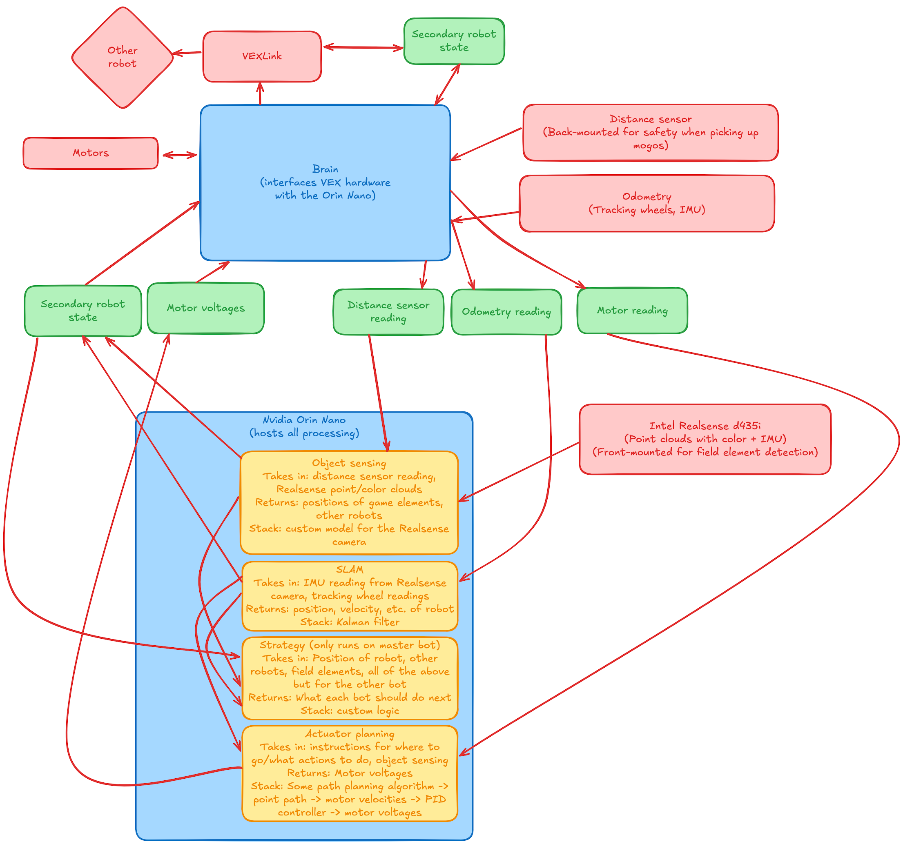

This is the fourth part of what will eventually be a five-part series. This focuses on my work on 3151A’s tech stack for the period of the season leading up to our first competition. Just one more post about VAIRC after this(!!)

Here are the previous posts:
* [Robotics 1: 315P (Over Under)](/robotics-1)
* [Robotics 2: 315P (High Stakes)](/robotics-2)
* [Robotics 3: 3151A (what makes VAIRC difficult?)](/robotics-3)

This is a **technical post.**

A massive thanks to Maxx from UT Austin, on the VEXU team GHOST, for helping me understand all of this stuff.
## Background<!-- {"fold":true} -->
First, VAIRC is, in essence, a robotics competition in which robots are controlled autonomously (by code and sensor inputs, not by drivers) and compete to score points. My work on the VAIRC team 3151A focused on the Interaction Period, a part of the match in which robots are free to roam the entire field to score. For more detail on how the game is played, feel free to check out my Robotics 3 post (linked above).

Second, there are a lot of options for how to play VEX AI. I detail most of them in Robotics 3. To simplify, there are a *lot* of ways to play VEX AI:
* Static routines — the robots follow a hardcoded path to score points. Simple to implement but won’t be able to score in the interaction period due to uncertainty about field state.
* the VEX AI Vision sensor — a sensor that VEX sells which offers basic capabilities to detect game elements.
* the VEX AI Platform — a "kit" which VEX sells consisting of an NVIDIA Jetson Nano (think tiny computer with GPU) and an Intel Realsense depth camera, as well as some custom software to run a YOLOv3n model to detect game elements and relay detections back to the brain.
* custom stuff — this is progressively crazier tech generally used by collegiate VEX U teams. It ranges from simple custom computer vision models to LiDAR, custom PCBs, etc. etc.

This recent post of mine on the VEX forums is a good explanation of the difference between the latter three:
> …The first is the [AI Vision Sensor](https://www.vexrobotics.com/276-8659.html). This is a V5 sensor legal for use in V5RC (and thus also in VURC, VAIC, etc.). The AI Vision sensor offers (to my knowledge) color blob detection as well as game element detection… You cannot train custom models using the AI Vision sensor (you technically can in VAIC, but that is another can of worms).
>
> The second is the [VEX AI System](https://kb.vex.com/hc/en-us/articles/360048984271-Getting-Started-With-the-VEX-AI-System). This is purpose built for VEX AI (while the AI Vision sensor is broadly applicable to the V5) and uses an external coprocessor (an NVIDIA Jetson Nano) in conjunction with a depth camera (Intel Realsense d435) to run a custom VEX model. This VEX model (which is a YOLOv3n model if I recall correctly) is also pretrained, see [this README on the High Stakes example repository](https://github.com/VEX-Robotics/VAIC_24_25/blob/main/JetsonExample/README.md). From what I see, it appears to have been trained on computed-generated imagery. You cannot train custom models for this system either (without quite a bit of work), but this model purportedly will have better accuracy for detecting game elements than the AI Vision sensor…
>
> The third is a custom model… 3151A observed a massive performance improvement (both speed and quality) over the VEX AI default model by training a custom model. The dataset we used spans about 600 images and is publicly available at [Roboflow](https://universe.roboflow.com/3151a/master-a0iy7).
>
> In order of accuracy, the AI Vision sensor is not super accurate (in my experience). The VEX AI System offers a relatively big jump. And if you are willing to jump through some hoops to run a custom model, that can be extremely rewarding. This is also the same order as effort needed; the AI Vision sensor requires very little setup, while getting the VEX AI system working might be difficult, while it takes a lot of effort to train a custom model.
>
> In terms of costs, the AI Vision sensor is a much cheaper option than either of the latter two… I would estimate costs of the VEX AI system and custom model to thus be roughly similar.

## Initial ideas<!-- {"fold":true} -->

When the team just got formed, I had no idea how we would play the game. I thus completely overestimated our ability to do things.

Note the many fancy terms here. The TL;DR is that I wanted to run as much as possible on a Jetson Orin Nano (not the Jetson Nano that comes with the VEX AI Platform) so we could have powerful hardware (aka GPU) to do cool stuff. What I eventually realized, however, is that getting this to work would require tens of thousands of lines of code. Given that this was 2 weeks before the competition, we decided to scrap this plan.

<aside>VEX teams are required to maintain an <em>engineering notebook</em> to log their development journey, which also helps when getting awards.</aside>

So what did we do instead?
Here’s an excerpt from our engineering notebook about how we handled this.
## The *actual* plan
Aadish focused mainly on future-leaning work including advanced strategy planning for the Interaction Period using the VEX AI Platform. Throughout the process, the engineering design process was repeated numerous times, iterating rapidly to meet deadlines while having a solid foundation.

The centerpiece of the AI Platform is the NVIDIA Jetson Nano, which has powerful on-device compute to run the pretrained VAIC models. At the beginning of the season, 3151A acquired one Jetson Nano and one NVIDIA Orin Nano (a more powerful version) to test and work with. Two Realsense d435 cameras were also acquired for imaging.

For the Orin (which arrived first), since the prebuilt AI image wouldn’t work given it ran Ubuntu 22 (compared to the Jetson Nano’s Ubuntu 18.04), we copied the Python and model files directly over to its drive. After installing the prerequired packages, we began to test the AI model. Unfortunately, despite our best efforts, we were unable to successfully feed the d435 image data into the provided neural network, and the resulting object detection was incorrect and laggy. About a week was spent troubleshooting the Orin, which involved modifying some Python code, rebuilding model metadata, etc. We eventually concluded that the Orin was not feasible to work with the AI Platform, and, thus, moved on to the Jetson Nano.

Since we had the same model of the Jetson Nano as the AI Platform recommended, we directly flashed the image onto an SD card using Balena Etcher and plugged the card into the Jetson. This unfortunately also did not work :( as the Realsense camera output shape appeared to be malformed compared to what the neural network was expected. We similarly devoted many resources to the issue, but were eventually unable to fully get it working. The WiFi module on the Jetson was also not working well, so we were unable to use `ssh` to gain more information remotely. After these endeavours, we concluded that using the VEX AI Platform with the pretrained neural network model was not feasible for the team. As more advanced solutions (such as training a custom model) were not possible given the timeframe, we turned to another VEX product that could interface directly with the brain…

We next moved on to try out the VEX AI Vision sensor, an upgrade over the initial Vision Sensor that crucially supported a (different) pretrained neural network model to detect game elements. After some initial testing, it seemed to be able to detect game elements with reasonable accuracy so we moved to the integration phase. Unfortunately, the only stable AI Vision API is supported by VEXcode V5 and its corresponding VSCode extension, which were not suitable for us as we used the open-source PROS kernel and PROS-dependent libraries for the entire codebase. Porting the codebase, which was greater than 2000 lines at the time, to VEXcode was obviously not possible, so we began looking into other ways to get the AI Vision’s detected bounding boxes into our PROS code.

One thing that stood out to us was that the VEXcode web interface contained all of the information we needed, included the bounding boxes for AI Classifications. If we could boot the web interface in a headless browser, interact programmatically to open the AI Vision box, and scrape the bounding box data, it would work perfectly! The obvious challenge is that you can’t run a browser, let alone a headless browser, on the V5 brain. Correspondingly, we decided to use the Jetson for this task. Initial attempts look fully promising, such as this fully automated test run on a test computer: https://drive.google.com/file/d/1gsAbUbUtpbH5e21sPx6MwVkyxonf77AO/view?usp=sharing. We even got it running fully on a Jetson Nano!


Note, however, that all of these tests were performed with our test computers connected to a display. Our Playwright code for the headless browser relied on using computer accessibility to interact with the page, which unfortunately isn’t possible if the Jetson isn’t connected to a display (since it won’t be in competition). Thus, this idea was unfortunately forced to be scrapped for the time being, although the code lives on on GitHub if anyone would like to take it further.

We finally went full-circle back to PROS. It turns out PROS has a nascent but functional AI Vision sensor API; we had done some initial tests but documentation for it was sparse and we were unable to get the data we needed. By this point though, the API was better-documented and supported all of the bounding box data we’d need, so we could successfully begin to use that. This itself was a journey, as this required upgrading to a beta PROS kernel (v5-4.2.0-pre) which had other major changes to the compiler — requiring us to rebuild any external libraries, even crucial ones like graphics drivers. We eventually were able to get it working though. Here’s a small part of our API surface for the interaction period utilizing the AI Vision:
```cpp
const int DELAY_TIME = 35;

struct DetectedObject {
    int x;
    int y;
    int color;
    std::array<int, 20> observations = {0};

    DetectedObject(pros::aivision_object_s_t object) {
        auto element = object.object.element;
        x = element.xoffset + element.width / 2;
        y = element.yoffset + element.height / 2;
        color = object.id == 1 ? RingColor::RED : RingColor::BLUE;
    }
    bool match(DetectedObject other, int threshold) {
        return color == other.color && abs(x - other.x) <= threshold &&
               abs(y - other.y) <= threshold;
    }
    int take_observations(pros::AIVision sensor) {
        for (auto &i : observations) {
            auto snapshot = sensor.get_all_objects();
            for (auto object : snapshot) {
                if (match(DetectedObject(object), 30))
                    i = std::max(i,
                                 static_cast<int>(object.object.element.score));
            }
            print(i);
            pros::delay(DELAY_TIME);
        }
        int total_score =
            std::accumulate(observations.begin(), observations.end(), 0);
        return total_score / 20;
    }
};
```
We were finally able to get the AI Vision sensor working in PROS! Yet there was one more obstacle remaining… the AI Vision is not very good 😭. It doesn’t detect rings that are less than 10 inches away or more than 30 inches away. Since our current plan for the interaction period was to scan the entire field from the corner and find viable rings to score, this severely limited our field of view to the point that the AI Vision sensor became useless. We thus decided to apply an age-old programming saying: *If the hardware ain't working…*

*Fix it in software.* We completely revamped our strategy and sensing stack to account for the AI Vision sensor’s shortcomings. The new idea was to temporarily leave the corner and zig-zag around the field. When we detect a ring of the correct color, we  stop and take a 1 second long snapshot. We then scan around 20 observations in a second and average the scores, comparing against a threshold to confirm that the ring is really there. Then we use our prebuilt intake API to hold the ring and drive to the nearest wall stake to score it. We can detect if another robot is blocking the wall stake using the current load on the drivetrain, and if there is a blockage, then we can speed over to the other wall stake to score. This was the final strategy we used and you can see it embodied in the above code.

For reference, here are the GitHub repositories providing all code that we tested on the Jetsons:
* https://github.com/aadishv/vexcode
* https://github.com/aadishv/Objects
## The *actual actual* plan (+ conclusion)
So, all is well and good. We’re using the AI Vision sensor via the unofficial PROS APIs. Great!

…if only. One of our teammates used Windows and, for the life of us, we couldn’t get the beta PROS kernel working (there are many reasons why, but the TL;DR is that we needed to recompile all of our libraries to a different ABI leading to a very fractured code

We ended up going the “static routine” way for our first competition. Our teammate (who goes by Chroma) cooked up a high-scoring autonomous routine for the 24” (big) bot and we tried to make the 15” (small) bot do something. Spoiler: we failed and Chroma basically carried us.

Spoiler 2: we weren’t the only team with nonfunctional code. Of all of the 8 teams there, around 3 had a static routine, and 2 had *only* a static routine. The other 5 teams that relied on AI had generally nonfunctional AI (or one that scored only one ring in the whole match), so they were automatically out of the running. Those two were us and team Power Beans, who were previously world finalists in the regular V5 robotics competition. Obviously, they had a much better routine than the one Chroma made in 30 minutes at the practice fields (no offense Chroma!).

Since basically no team moved much after the static (isolation) period, we ended up with videos like this one of an “Average VEX AI Match”:

<video src="/videos/ai-match.mp4" controls></video>


We ended up ranked second and made it to the finals, where we (inevitably) lost to Power Beans. We also got Excellence Award thanks to all of our (cool but ultimately useless) efforts in the AI part.


Overall, it was fun! We also got to ~~steal some tech~~ get inspired by some of the teams that had tried using AI. Big thanks to Chroma for being the reason we won any matches at all.

Just one more blog post left for VAIRC. That one’s gonna be *very* technical and *very long*…
